# Lesson 06 - Advanced Circuit Analysis Techniques - Part 01

## Thevenin's Theorem

Thevenin\'s theorem states that *any linear circuit containing one or
more voltage and/or current sources and resistances can be replaced by a
single Thevenin voltage source* $V_{TH}$ *in series with a single
Thevenin resistor* $R_{TH}$.

<!-- {.align-center
width="75.0%"} -->

 <figure style="text-align:center">
  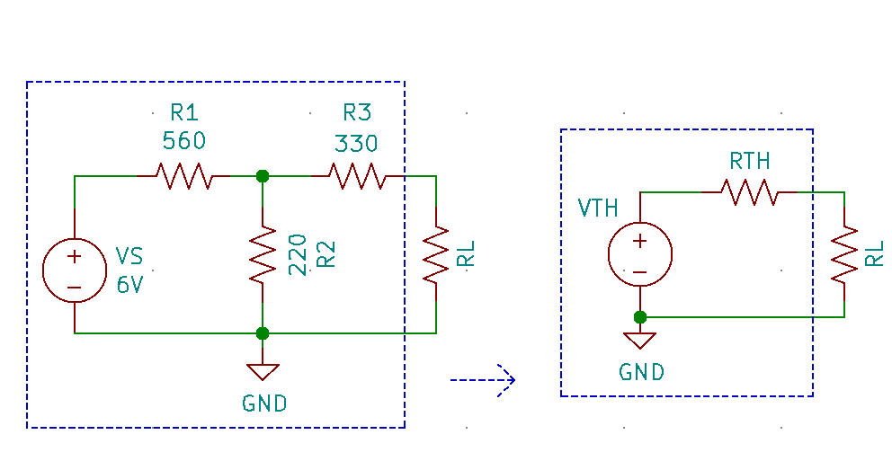
  <figcaption>Figure 1 - Thevenin Theorem</figcaption>
</figure> 

The procedure to calculate $V_{TH}$ and $R_{TH}$ for a given circuit is
as follows:

-   To calculate $R_{TH}$:
    1. replace all sources with their ideal source resistances
       a.  Replace each current source in the circuit with an open circuit
       b.  Replace each voltage source in the circuit with a short circuit
    2.  Remove the load resistance from the output terminals and
       a. Calculate the circuit resistance looking in through output terminals. This resistance is $R_{TH}$.

-   To calculate $V_{TH}$:
    1.  Remove the load resistance, leaving an open circuit across the output terminals.
    2.  Calculate the voltage across the output terminals. This voltage will be $V_{TH}$.

This method is best shown by an example.

### Example 1

Find the Thevenin equivalent of the circuit shown in the above
schematic.

**Solution**

<!-- {.align-center
width="75.0%"} -->

 <figure style="text-align:center">
  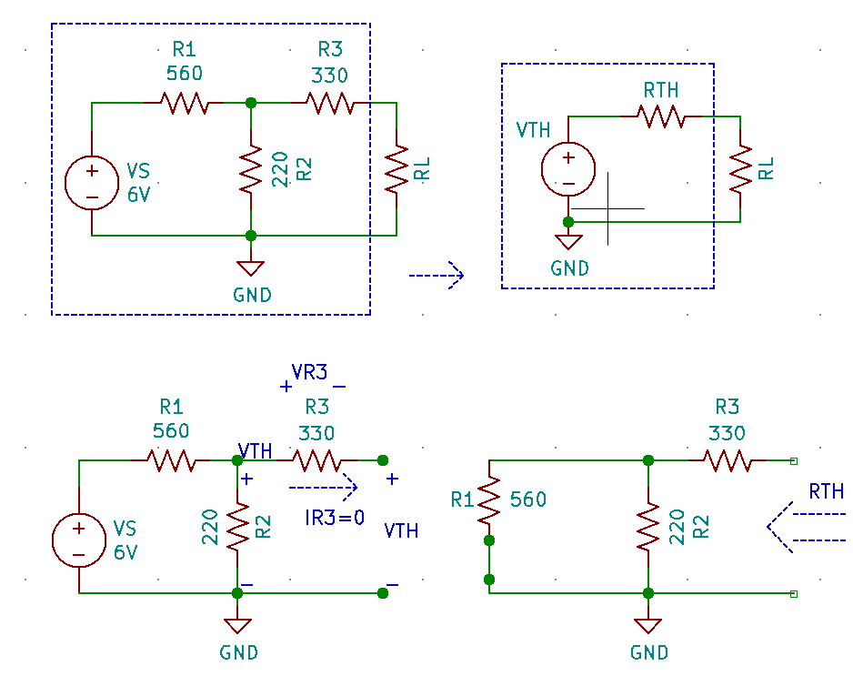
  <figcaption>Figure 2 - Thevenin Theorem Example 01 p1</figcaption>
</figure> 

To solve for $V_{TH}$ first, remove the load resistance. Then calculate the voltage across the output terminals. Because the output terminals are open, no current flows through $R_3$, therefore there's no voltage drop across it. This means that the voltage at the output terminals ($V_{TH}$) is also across $R_2$. In this particular scenario, 

$$V_{TH} = V_S \cdot \frac{R_2}{R_1 + R_2} = 6V \cdot \frac{220 \Omega}{220 \Omega + 560 \Omega} = 1.692V$$

To calculate $R_{TH}$, replace the voltage source with a short, remove the load resistance and calculate the resistance of the circuit looking into the load terminals

$$R_{TH} = (R1 \parallel R2) + R3 = \frac{R_1 \cdot R_2}{ R_1 + R_2} + R_3 =\frac{560\Omega \cdot 220\Omega}{ 560\Omega + 220\Omega} + 330\Omega = 487.948\Omega$$

Therefore, the Thevenin equivalent circuit is:

<!-- {.align-center
width="50.0%"} -->

 <figure style="text-align:center">
  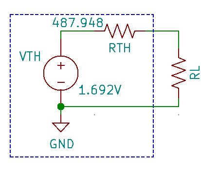
  <figcaption>Figure 3 - Thevenin Theorem Example 01 p2</figcaption>
</figure> 

To verify that the Thevenin equivalent is indeed the same as the original circuit, place the same load resistance across the load
terminals of both circuits and calculate $V_{RL}$ and $I_{RL}$. If they are the same in both circuits, then the circuits are indeed identical. This can be easily accomplished with a circuit simulator  such as LTSpice.

### Example 2

Find the Thevenin equivalent of the circuit shown in the schematic below.

<!-- {.align-center
width="70.0%"} -->

 <figure style="text-align:center">
  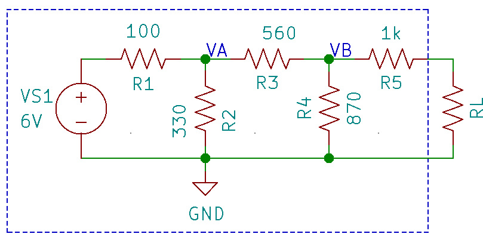
  <figcaption>Figure 4 - Thevenin Theorem Example 02 p1</figcaption>
</figure> 

**Solution**

<!-- {.align-center
width="100.0%"} -->

 <figure style="text-align:center">
  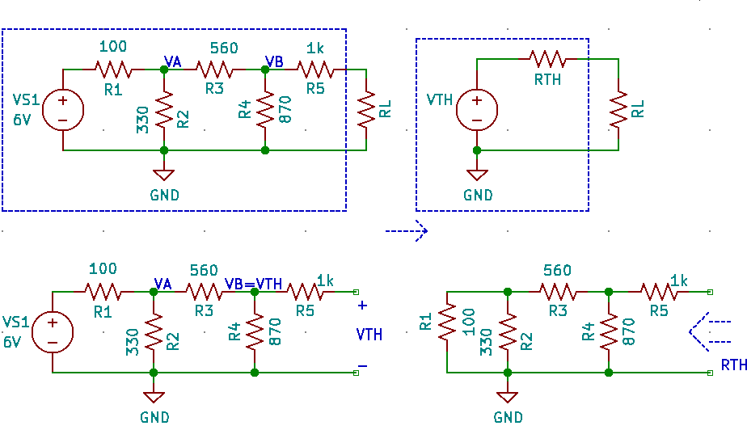
  <figcaption>Figure 5 - Thevenin Theorem Example 02 p2</figcaption>
</figure> 

To solve for $V_{TH}$ first remove the load resistance. Then calculate the voltage across the output terminals. Because the output terminals are open, no current flows through $R_5$, therefore there\'s no voltage drop across it. This means that the voltage at the output terminals ($V_{TH}$) is also across $R_4$. In this particular scenario, In order to calculate $V_{TH}$, $V_{A}$ will have to be calculated first.

<!-- {.align-center
width="100.0%"} -->

 <figure style="text-align:center">
  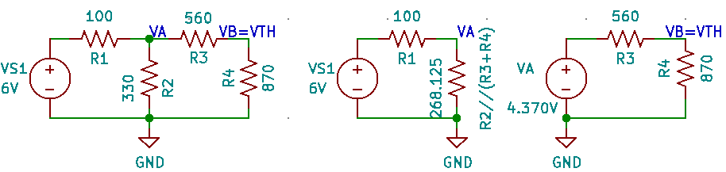
  <figcaption>Figure 6 - Thevenin Theorem Example 02 p3</figcaption>
</figure> 

To solve for $V_{A}$, find the equivalent resistance of resistances $R_2$, $R_3$ & $R_4$, compressing the circuit into a series circuit; then use a voltage divider to solve for $V_A$

$$R_{{EQ}_1} = R_2 \parallel (R_3 + R_4) = \frac{ 330 \cdot 1430}{ 330 + 1430 } = 268.125\Omega$$

$$V_A = V_{S1} \cdot \frac{  R_{{EQ}_1}}{  R_{{EQ}_1} + R_1} = 6V \cdot \frac{268.125\Omega}{268.125\Omega + 100\Omega} =  4.370V$$

Since the branch containing resistors $R_3$ & $R_4$ is in parallel with $R_2$ it can be modeled as an independent series circuit with a voltage source of $V_A$. Another voltage divider can be then used to solve for $V_{TH}$\:

$$V_{TH} = V_A \cdot \frac{R_4}{R_3 + R_4} = 4.370V \cdot \frac{870\Omega}{560\Omega + 870\Omega} = 2.659V$$

Solving for $R_{TH}$ involves replacing the voltage source with a short circuit, removing the load resistor and calculating the overall
equivalent resistance of the circuit looking into the output terminals.

$$R_{TH} = (((R_1 \parallel R_2) + R_3) // R4) + R_5 = 1367.659\Omega$$

Therefore the Thevenin equivalent circuit is:

<!-- {.align-center
width="50.0%"} -->

 <figure style="text-align:center">
  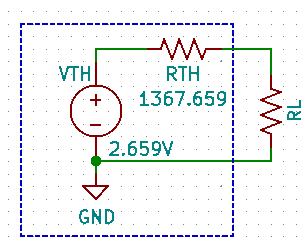
  <figcaption>Figure 7 - Thevenin Theorem Example 02 p4</figcaption>
</figure> 

To verify this, simulate both the original and Thevenin equivalent circuits in LTSPice; setting the load resistance in both circuits to the same value, say 1kΩ, then take note of the voltage across the load $V_{RL}$ and the current passing through the load $I_{RL}$. They should be the same in both circuits.

## Norton\'s theorem

Norton\'s theorem states that *any linear circuit containing one or more voltage and/or current sources and resistances can be replaced by a single Norton current source* $I_{N}$ *in parallel with a single Norton resistor* $R_{N}$.

<!-- {.align-center
width="75.0%"} -->

 <figure style="text-align:center">
  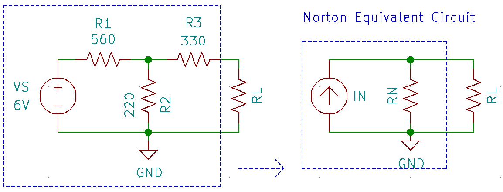
  <figcaption>Figure 8 - Norton Theorem</figcaption>
</figure> 

The procedure to calculate $I_{N}$ and $R_{N}$ for a given circuit is as follows:

- The procedure for calculating the Norton resistance $R_{N}$ is basically the same as the procedure for calculating the Thevenin resistance $R_{TH}$ :
  1. Replace all sources with their ideal source resistances
     a. Replace each current source in the circuit with an open circuit
     b. Replace each voltage source in the circuit with a short circuit
  2. Remove the load resistance from the output terminals and calculate the circuit resistance looking in through output terminals. This resistance is $R_{TH}$.

- To calculate $I_{N}$:
  1.  Replace the load resistance with a wire (or short).
  2.  Calculate the current flowing through that wire. This current is the Norton current $I_{N}$

### Example 3

Find the Norton equivalent of the circuit shown in the schematic below.

<!-- {.align-center
width="75.0%"} -->

 <figure style="text-align:center">
  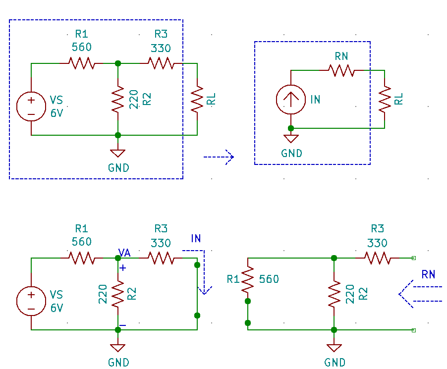
  <figcaption>Figure 9 - Norton Theorem example 3 p1</figcaption>
</figure> 

To solve for $I_{N}$ replace the load resistance with a wire. Then calculate the current $I_N$ flowing through that wire.

Since this is a series parallel circuit, node voltage $V_A$ must be found first. Compress $R_2$ and $R_3$ into a single equivalent
resistance as shown in the figure below:

<!-- {.align-center
width="75.0%"} -->

 <figure style="text-align:center">
  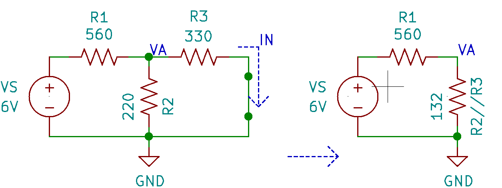
  <figcaption>Figure 10 - Norton Theorem example 3 p2</figcaption>
</figure> 

$$R_2 \parallel R_3 = \frac{R_2 \cdot R_3}{R_2 + R_3} = \frac{220 \Omega \cdot 330 \Omega }{220 \Omega + 330 \Omega} = 132 \Omega$$

$V_A$ can now be calculated using a simple voltage divider:

$$V_A = V_S \cdot \frac{R_2 \parallel R_3}{ (R_2 \parallel R_3)  + R_1} = 6 \cdot \frac{132 \Omega}{ (132 \Omega)  + 560 \Omega } = 1.145V$$

Knowing $V_A$, $I_N$ can be calculated as:

$$I_N = \frac{V_A}{R_3} = \frac{1.145V}{330 \Omega} = 3.470mA$$

To calculate $R_{N}$, replace the voltage source with a short, remove the load resistance and calculate the resistance of the circuit looking into the load terminals. This is the same procedure as for calculating $R_{TH}$, so $R_{N}$ has to be equal to $R_{TH}$ in example 1.

> $$R_{N} = (R1 \parallel R2) + R3 = \frac{R_1 \cdot R_2}{ R_1 + R_2} + R_3 =\frac{560\Omega \cdot 220\Omega}{ 560\Omega + 220\Omega} + 330\Omega = 487.948\Omega$$

Therefore the Norton equivalent circuit is:

<!-- {.align-center
width="50.0%"} -->

 <figure style="text-align:center">
  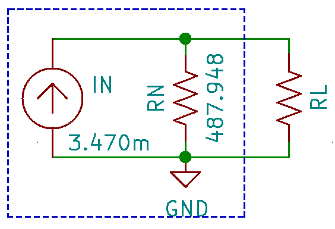
  <figcaption>Figure 11 - Norton Theorem example 3 p3</figcaption>
</figure> 

To verify that the Norton equivalent is indeed the same as the original circuit, place the same load resistance across the load terminals of both circuits and calculate $V_{RL}$ and $I_{RL}$. If they are the same in both circuits then the circuits are indeed identical. This can be easily accomplished through circuit simulation

## Converting Thevenin and Norton Equivalent Circuits using Source Conversions

Since Thevenin and Norton equivalent circuits have the same topology as practical voltage and current sources respectively, source conversions can be performed on either circuit to convert it to the other.

When converting a Thevenin circuit to its equivalent Norton circuit, the Norton current and resistance can be calculated as follows:

$$I_N = \frac{V_{TH}}{R_{TH}}$$

$$R_N = R_{TH}$$

When converting a Norton circuit to its equivalent Thevenin circuit, the Thevenin voltage and resistance can be calculated as follows:

$$V_{TH} = I_N \cdot R_N$$

$$R_{TH} = R_{N}$$

<!-- {.align-center
width="50.0%"} -->

<figure style="text-align:center">
  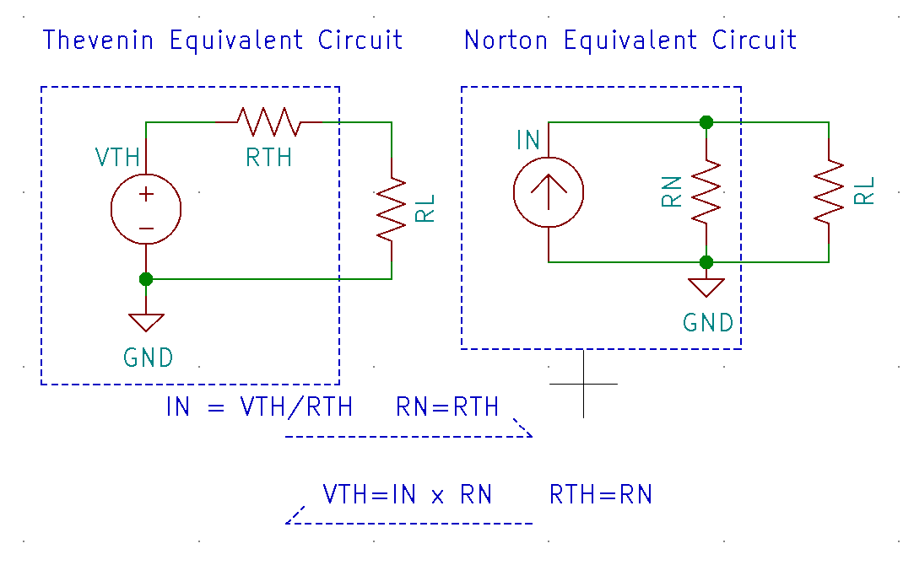
  <figcaption>Figure 12 - Source conversions</figcaption>
</figure> 

### Example 4

In examples 1 and 3, the Thevenin and Norton equivalent circuits were derived independently.

a.  Convert the independently derived Thevenin equivalent circuit to a Norton equivalent circuit using source conversions. Is it identical to the independently derived Norton circuit?
b.  Convert the independently derived Norton equivalent circuit to a Thevenin equivalent circuit using source conversions. Is it identical to the independently derived Thevenin circuit?

<!-- {.align-center
width="50.0%"} -->

<figure style="text-align:center">
  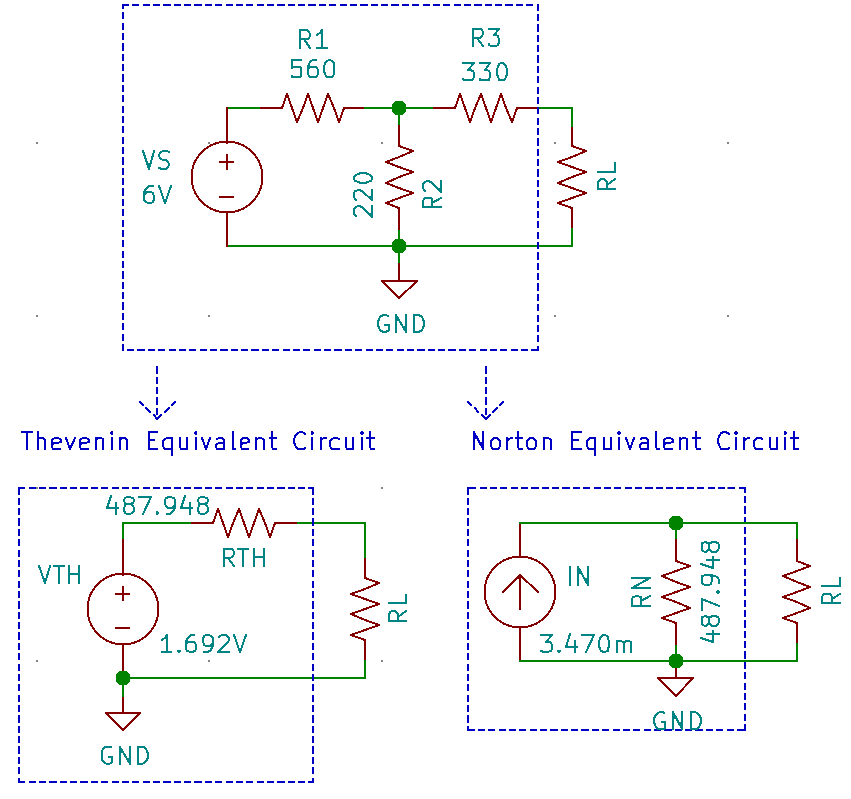
  <figcaption>Figure 13 - Source conversions EX4 p1</figcaption>
</figure> 

**Solution**

a.  Converting a Thevenin circuit to its equivalent Norton circuit:

$$I_N = \frac{V_{TH}}{R_{TH}} =  \frac{1.692V}{487.948\Omega} = 3.468mA$$

$$R_N = R_{TH} = 487.948\Omega$$

The Norton current $I_N$ and Norton resistance $R_N$ derived from source converting the Thevenin circuit are equivalent to the Norton current
$I_N$ and Norton resistance $R_N$ values derived independently.

b.  Converting a Norton circuit to its equivalent Thevenin circuit:

$$V_{TH} = I_N \cdot R_N  = 3.470mA \cdot 487.948\Omega = 1.701V$$

$$R_{TH} = R_{N} = 487.948\Omega$$

The Norton current $I_N$ and Norton resistance $R_N$ derived from source converting the Thevenin circuit are equivalent to the Norton current
$I_N$ and Norton resistance $R_N$ values derived independently.

## The Principle of Superposition

The principle of superposition is typically used to help analyze circuits with two or more power sources. This principle states: *The total current in any part of a linear circuit equals the algebraic sum of the currents produced by each source separately.*

To solve a circuit using superposition, the first step is to turn off or suppress all but one power source.

-   To suppress a voltage source, replace it with a short circuit (ideal source resistance).
-   To suppress a current source, replace it with an open circuit (ideal source resistance).

Then analyze the resulting simpler circuits. Repeat for all inputs. The final result is the sum of individual results.

Consider the circuit with two voltage sources shown in the figure below:

<!-- {.align-center
width="50.0%"} -->

<figure style="text-align:center">
  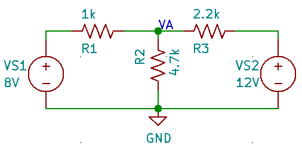
  <figcaption>Figure 14 - Superposition</figcaption>
</figure> 

To solve for $V_A$, first replace $V_{S2}$ with a short and analyze the circuit with only supply $V_{S1}$, to solve for $V_{A_{V_{S1}}}$. Then replace $V_{S1}$ with a short and analyze the circuit again with only supply $V_{S2}$ to solve for $V_{A_{V_{S2}}}$. Finally, add (or superpose) $V_{A_{V_{S1}}}$ and $V_{A_{V_{S2}}}$ to solve for $V_A$ in the original circuit.

$$V_{A} = V_{A_{V_{S1}}} + V_{A_{V_{S2}}}$$

### Example 5

Find the node voltage $V_A$ in the circuit shown above:

**Solution**

<!-- {.align-center
width="85.0%"} --->

<figure style="text-align:center">
  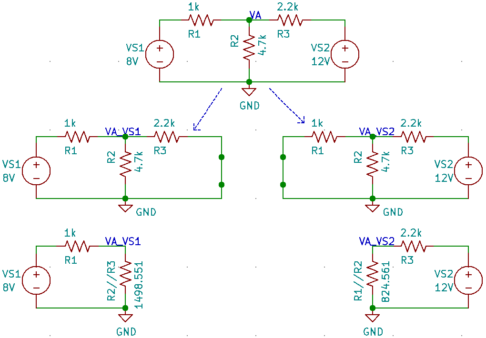
  <figcaption>Figure 15 - Superposition Example 5</figcaption>
</figure> 

The first step is replace $V_{S2}$ with a short and analyze the circuit with only $V_{S1}$ to determine $V_A$ due to only $V_{S1}$ :
$V_{A_{V_{S1}}}$. Because $V_{S2}$ is replaced with a short, resistors $R_2$ and $R_3$ are in parallel. They can be compressed into a single
equivalent resistance $R_2 // R_3$, which reduces the circuit to a series circuit. Now $V_{A_{V_{S1}}}$ is simply the voltage across $R_2 /parallel R_3$ and can be calculated with a simple voltage divider.

$$R_2 \parallel R_3 = \frac{R_2 \cdot R_3}{ R_2 + R_3} = \frac{4.7k\Omega \cdot 2.2k\Omega }{ 4.7k\Omega  + 2.2k\Omega} = 1498.551 \Omega$$

$$V_{A_{V_{S1}}} = V_{S1} \cdot \frac{R_2 \parallel R_3}{\left(R_2 \parallel R_3 \right) + R_1}  =  8V \cdot \frac{1498.551 \Omega}{1498.551 \Omega + 1k\Omega} = 4.798 V$$

Next replace $V_{S1}$ with a short and analyze the circuit with only $V_{S2}$ to determine $V_A$ due to only $V_{S2}$ : $V_{A_{V_{S2}}}$.
Because $V_{S1}$ is replaced with a short, resistors $R_1$ and $R_2$ are in parallel. They can be compressed into a single equivalent resistance
$R_1 // R_2$, which reduces the circuit to a series circuit. Now $V_{A_{V_{S2}}}$ is simply the voltage across $R_1 // R_2$ and can be calculated with a simple voltage divider.

$$R_1 \parallel R_2 = \frac{R_1 \cdot R_3}{ R_1 + R_3} = \frac{1k\Omega \cdot 4.7k\Omega }{ 1k\Omega  + 4.7k\Omega} = 824.561 \Omega$$

$$V_{A_{V_{S2}}} = V_{S2} \cdot \frac{R_1 \parallel R_2}{\left(R_1 \parallel R_2 \right) + R_3}  =  12V \cdot \frac{824.561 \Omega}{824.561 \Omega + 2.2k\Omega} = 3.271 V$$

Now to solve for the true $V_A$ in the original circuit with both power sources $V_{S1}$ and $V_{S2}$ :

$$V_{A} = V_{A_{V_{S1}}} + V_{A_{V_{S2}}} = 4.798 V + 3.271 V = 8.069 V$$

This result can be easily verified with simulation.

### Example 6

Solve for voltage $V_A$ in the circuit shown below:

<!-- {.align-center
width="50.0%"} -->

<figure style="text-align:center">
  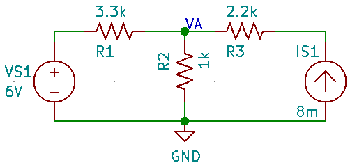
  <figcaption>Figure 16 - Superposition Example 6 p1</figcaption>
</figure> 

**Solution**

<!-- {.align-center
width="85.0%"} -->

<figure style="text-align:center">
  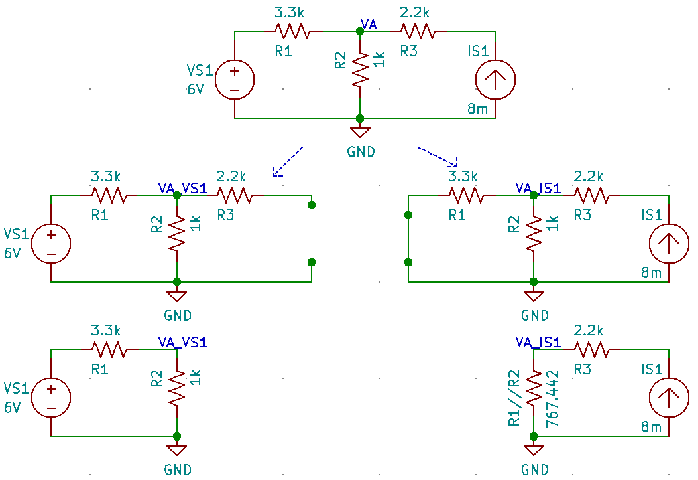
  <figcaption>Figure 17 - Superposition Example 6 p2</figcaption>
</figure> 

The first step is replace $I_{S1}$ with an **open** and analyze the circuit with only $V_{S1}$ to determine $V_A$ due to only $V_{S1}$ : $V_{A_{V_{S1}}}$. Because $I_{S1}$ is replaced with an open, resistor $R_3$ has no current flowing through it nor voltage drop across it and can be discarded leaving a simple series circuit with only $V_{S1}$,
$R_1$ and $R_2$. $V_{A_{V_{S1}}}$ is simply the voltage across $R_2$ and can be calculated with a simple voltage divider.

$$V_{A_{V_{S1}}} = V_{S1} \cdot \frac{R_2}{R_2 + R_1}  =  6V \cdot \frac{1k\Omega}{3.3k\Omega + 1k\Omega} = 1.395 V$$

Next replace $V_{S1}$ with a short and analyze the circuit with only $I_{S1}$ to determine $V_A$ due to only $1_{S1}$ : $V_{A_{I_{S1}}}$.
Because $V_{S1}$ is replaced with a short, resistors $R_1$ and $R_2$ are in parallel. They can be compressed into a single equivalent resistance
$R_1 // R_2$, which reduces the circuit to a series circuit with a current $I_{S1}$ flowing through all components. $V_{A_{I_{S1}}}$ is the
voltage across $R_1 // R_2$ and can be calculated via Ohm\'s law i.e. multiplying current $I_{S1}$ with resistance $R_1 // R_2$.

$$R_1 \parallel R_2 = \frac{R_1 \cdot R_2}{ R_1 + R_2} = \frac{3.3k\Omega \cdot 1k\Omega }{ 3.3k\Omega  + 1k\Omega} = 767.442 \Omega$$

$$V_{A_{I_{S1}}} = I_{S1} \cdot (R_1 \parallel R_2)  =  8mA \cdot 767.442 \Omega = 6.140 V$$

Now to solve for the true $V_A$ in the original circuit with both power sources $V_{S1}$ and $V_{S2}$ :

$$V_{A} = V_{A_{V_{S1}}} + V_{A_{I_{S1}}} = 1.395 V + 6.140 V = 7.535V$$

This result can be verified with simulation:

### Example 7

Find node voltages $V_A$ & $V_B$ in the circuit shown below:

<!-- {.align-center
width="60.0%"} -->

<figure style="text-align:center">
  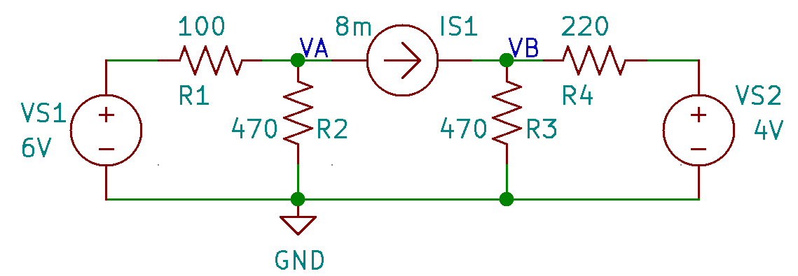
  <figcaption>Figure 18 - Superposition Example 7 p1</figcaption>
</figure> 

**Solution**

First replace $V_{S2}$ with a short $I_{S1}$ with and open to analyze
the circuit with voltage source $V_{S1}$. Now find $V_{A_{V_{S1}}}$ and
$V_{B_{V_{S1}}}$. The circuit is now broken into two simpler circuits.

<!-- {.align-center
width="60.0%"} -->

<figure style="text-align:center">
  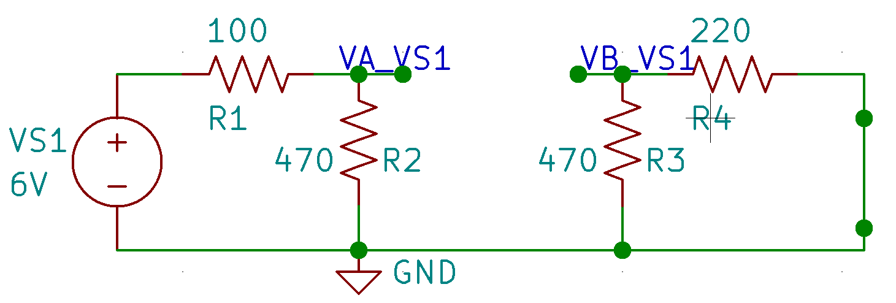
  <figcaption>Figure 19 - Superposition Example 7 p2</figcaption>
</figure> 

The one on the right (with branches containing resistors $R_3$ and $R_4$) has no power source in it and therefore:

$$V_{B_{V_{S1}}} = 0V$$

The circuit on the left is a simple series circuit. $V_{A_{V_{S1}}}$ can be found with a simple voltage divider:

$$V_{A_{V_{S1}}} = V_{S1} \cdot \frac{R_2}{R_1 + R_2} = 6V \cdot \frac{470\Omega}{100\Omega + 470\Omega} = 4.947V$$

Next replace $V_{S1}$ with a short $I_{S1}$ with and open to analyze the circuit with voltage source $V_{S2}$. Now find $V_{A_{V_{S2}}}$ and $V_{B_{V_{S2}}}$. The circuit is again broken into two simpler circuits.

<!-- {.align-center
width="60.0%"} -->

<figure style="text-align:center">
  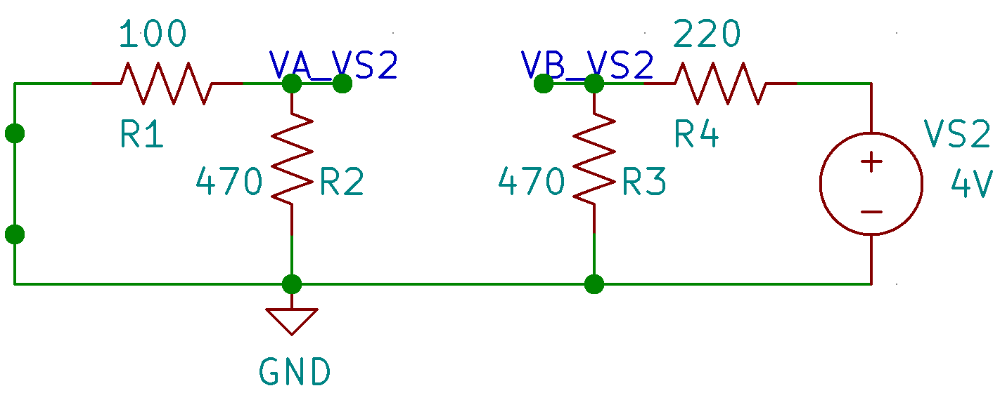
  <figcaption>Figure 20 - Superposition Example 7 p3</figcaption>
</figure> 

The one on the left (with branches containing resistors $R_1$ and $R_1$) has no power source in it and therefore:

$$V_{A_{V_{S2}}} = 0V$$

The circuit on the right is a simple series circuit. $V_{B_{V_{S2}}}$ can be found with a simple voltage divider:

$$V_{B_{V_{S2}}} = V_{S2} \cdot \frac{R_3}{R_3 + R_4} = 4V \cdot \frac{470\Omega}{470\Omega + 220\Omega} = 2.725V$$

Finally replace both $V_{S1}$ and $V_{S2}$ with shorts $I_{S1}$ to analyze the circuit with current source $I_{S1}$. Now find $V_{A_{I_{S1}}}$ and $V_{B_{I_{S1}}}$.

<!-- {.align-center
width="90.0%"} -->

<figure style="text-align:center">
  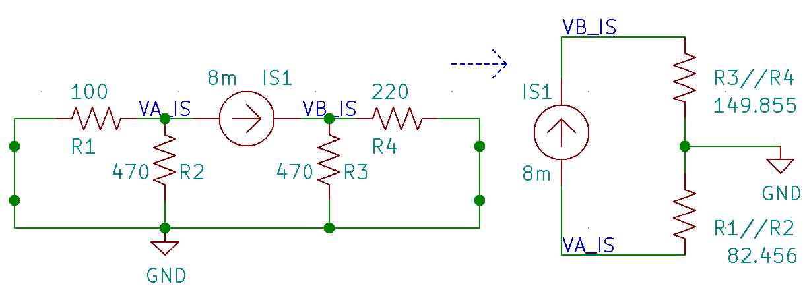
  <figcaption>Figure 21 - Superposition Example 7 p4</figcaption>
</figure> 

First notice that resistors $R_1$ and $R_2$ are in parallel and that resistors $R_3$ and $R_4$ are also in parallel. Finding their equivalent resistances $R_1 \parallel R_2$ & $R_3 \parallel R_4$ we get:

$$R_1 \parallel R_2 = \frac{R_1 \cdot R_2}{R_1 + R_2} = \frac{100\Omega \cdot 470\Omega }{ 100\Omega  + 470\Omega} = 82.456 \Omega$$

$$R_3 \parallel R_4 = \frac{R_3 \cdot R_4}{R_3 + R_4} = \frac{470\Omega \cdot 220\Omega }{ 470\Omega  + 220\Omega} = 149.855 \Omega$$

Compressing these parallel resistances, reduces the circuit to a series circuit. However take note of the position of the reference ground terminal. Note how the node voltage $V_{A_{I_{S1}}}$ is below the ground point implying that it is a negative voltage.

$$V_{B_{I_{S1}}} = I_{S1} * (R_3 \parallel R_4) = 8mA \cdot 149.855 \Omega = 1.199V$$

$$V_{A_{I_{S1}}} = -I_{S1} * (R_3 \parallel R_4) = -8mA \cdot 82.456 \Omega = -0.660V$$

Now to solve for the true $V_A$ and $V_B$ in the original circuit with all power sources $V_{S1}$, $V_{S2}$ and $I_{S1}$ :

$$V_{A} = V_{A_{V_{S1}}} + V_{A_{V_{S2}}} + V_{A_{I_{S1}}} = 4.947V + 0V + -0.660V = 4.287V$$

$$V_{B} = V_{B_{V_{S1}}} + V_{B_{V_{S2}}} + V_{B_{I_{S1}}} = 0V + 2.725V + 1.199V = 3.924V$$

This result can be verified with simulation.
