# Lesson 04 - Parallel Circuits

A Parallel circuit is a circuit whose components (current source and resistors) are all placed in parallel as shown in the figure below.

<!-- {.align-center
width="60.0%"} -->

 <figure style="text-align:center">
  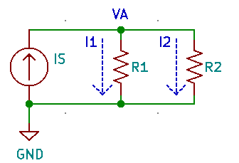
  <figcaption>Figure 1 - Parallel Circuits</figcaption>
</figure> 

In parallel circuits the voltage rise/drop across all components is the same. Also power sources are typically represented as **current
sources** as shown above. In order to further analyze parallel circuits, some basic rules of electrical circuits will have to be covered. These include, calculating equivalent resistances of resistors in parallel, Kirchhoff\'s current law, and the current divider rule.

## Equivalent resistances in parallel

The equivalent resistance of two or more resistors in parallel can be calculated using two approaches; **product over sum rule** and the **inverse rule**.

The product over sum rule can calculate the equivalent parallel resistance of a maximum of two resistors at a time. The formula for it
is:

$$R_T = \frac{R_1 \cdot R_2 }{ R_1 + R_2 }$$

### Example 1

Calculate the total equivalent resistance of the circuit shown in the
schematic below using the product over sum rule

<!-- {.align-center
width="60.0%"} -->

 <figure style="text-align:center">
  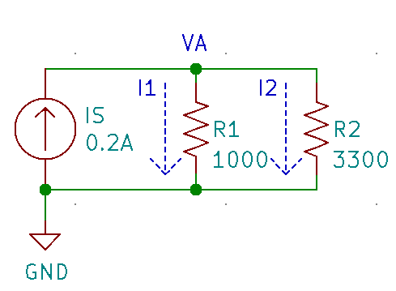
  <figcaption>Figure 2 - Example 1</figcaption>
</figure> 

#### Solution

$$R_T = \frac{R_1 \cdot R_2 }{ R_1 + R_2 } = \frac{1000*3300}{1000+3300} = \frac{3300000}{4300} = 767.442\Omega$$

### Example 2

Calculate the total equivalent resistance of the circuit shown in the
schematic below using the product over sum rule

<!-- {.align-center
width="60.0%"} -->

 <figure style="text-align:center">
  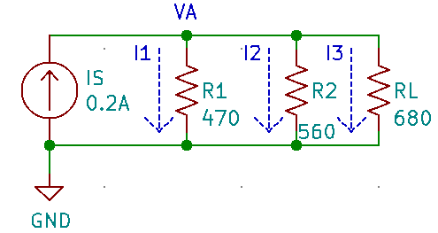
  <figcaption>Figure 3 - Example 2</figcaption>
</figure> 

#### Solution

First apply the product over sum rule to any two of the three resistors:
       
$$R_{T_{12}} = \frac{R_1 \cdot R_2 }{ R_1 + R_2 } = \frac{470*560}{470+560} = \frac{263200}{1030} = 255.534\Omega$$
   
Now re-apply the product over sum rule on the result of the first operation and the third resistor:
       
$$R_{T} = \frac{ R_{T_{12}} \cdot R_3 }{ R_{T_{12}} + R_3 } = \frac{255.534*680}{255.534+680} = \frac{173763.120}{935.534} = 185.737\Omega$$

The inverse rule for calculating equivalent resistance of resistors in parallel is provided below:

$$R_T = \frac{ 1 }{ \frac{1}{R_1} +  \frac{1}{R_2} +  \frac{1}{R_3} + \cdots + \frac{1}{R_N} }$$

Unlike the product over sum rule, which can only be applied to two resistors in parallel at a time, the inverse rule can be applied to
multiple resistors. Use either the product over sum rule or the inverse rule if you want to calculate the equivalent resistance of two resistors in parallel. If you want to calculate the equivalent resistance of more resistors in parallel always go for the inverse rule.

### Example 3

Calculate the total equivalent resistance of the circuit shown in the schematic in Example 1 using the inverse rule

#### Solution

$$R_T = \frac{ 1 }{ \frac{1}{R_1} +  \frac{1}{R_2}  } = \frac{ 1 }{ \frac{1}{1000} +  \frac{1}{3300} } = 767.442\Omega$$

### Example 4

Calculate the total equivalent resistance of the circuit shown in the schematic in Example 2 using the inverse rule

#### Solution

$$R_T = \frac{ 1 }{ \frac{1}{R_1} +  \frac{1}{R_2} + +  \frac{1}{R_3} } = \frac{ 1 }{ \frac{1}{470} +  \frac{1}{560} +  \frac{1}{680} } = 185.737\Omega$$

Notice how **the parallel equivalent resistance is always smaller than the smallest resistor in the parallel combination**.

When calculating the equivalent resistance of a very small resistor and a very large resistor (say 100 times larger than the smaller resistor), the equivalent resistance will always be approximately the same as the smaller resistor (a tiny bit smaller actually). This is because the vast majority of the current will end up flowing across the smaller resistor.

### Example 5

1.  Calculate the parallel equivalent resistance of two resistors; $10\Omega$ and $1k\Omega$ in parallel.
2.  Calculate the parallel equivalent resistance of two resistors; 10\Omega$ and $10k\Omega$ in parallel.

#### Solution

1. $R_T = \frac{ 1 }{ \frac{1}{R_1} +  \frac{1}{R_2}  } = \frac{ 1 }{ \frac{1}{10} +  \frac{1}{1000}  } = 9.9\Omega$
2. $R_T = \frac{ 1 }{ \frac{1}{R_1} +  \frac{1}{R_2}  } = \frac{ 1 }{ \frac{1}{10} +  \frac{1}{10000}  } = 9.99\Omega$

When $N$ resistors of the same value $R$ are placed in parallel, their equivalent resistance will always equal:

$$R_T = \frac{R}{N}$$

### Example 6

1.  Calculate the equivalent resistance of 2 $600\Omega$ resistors in parallel.
2.  Calculate the equivalent resistance of 3 $600\Omega$ resistors in parallel.

#### Solution

1. $$R_T = \frac{ 1 }{ \frac{1}{R_1} +  \frac{1}{R_2}  } = \frac{ 1 }{ \frac{1}{600} +  \frac{1}{600}  } = 300\Omega \equiv \frac{600}{2}$$
2. $$R_T = \frac{ 1 }{ \frac{1}{R_1} +  \frac{1}{R_2} +  \frac{1}{R_3}  } = \frac{ 1 }{ \frac{1}{600} +  \frac{1}{600} +  \frac{1}{600}  } =  200\Omega \equiv \frac{600}{3}$$

## Kirchhoff\'s Current Law

Kirchhoff\'s current law (KCL) states that **the sum of all currents entering or leaving a node has to equal zero**.

<!-- {.align-center
width="60.0%"} -->

 <figure style="text-align:center">
  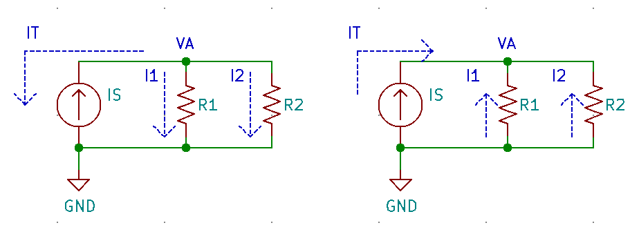
  <figcaption>Figure 4 - KCL</figcaption>
</figure> 

KCL can be written as:

$$I_T + I_1 + I_2 = 0$$

A more general case:

$$I_T + I_1 + I_2 + \cdots + I_N = 0$$

In a single current supply circuit as the one shown below, notice that the supply current moves into the node whereas the current moving through the resistors are moving out of the node.

<!-- {.align-center
width="60.0%"} -->

 <figure style="text-align:center">
  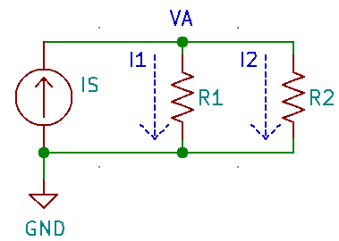
  <figcaption>Figure 5 - KCL</figcaption>
</figure> 

Assuming that that the supply current direction is +ve and the currents flowing through the two resistors are negative:

$$I_S - I_1 - I_2 = 0$$ 
$$I_S = I_1 + I_2$$

In otherwords, KCL can also be defined as **the sum of all currents entering a node must equal the sum of all currents leaving the same
node**

### Example 7

In the circuit below calculate:

<!-- {.align-center
width="60.0%"} -->

<figure style="text-align:center">
  
  <figcaption>Figure 6 - Example 7</figcaption>
</figure> 

1.  The total equivalent resistance $R_T$
2.  The voltage $V_A$
3.  The currents $I_1$ & $I_2$
4.  Verify KCL i.e. verify that $I_S = I_1 + I_2$
5.  Verify the law of conservation of energy. i.e.
    $P_{I_S} = P_{R_1} + P_{R_2}$

#### Solution

The trick to analyzing this circuit is to transform it first into a series circuit by calculating $R_T$. Then use Ohm's law to solve for $V_A$. Since the voltage across $R_T$ in the transformed circuit is equivalent to the voltage across all components in the original circuit, we can then use it along with Ohm's law to calculate the currents $I_1$ and $I_2$.

   <!--  -->

<figure style="text-align:center">
  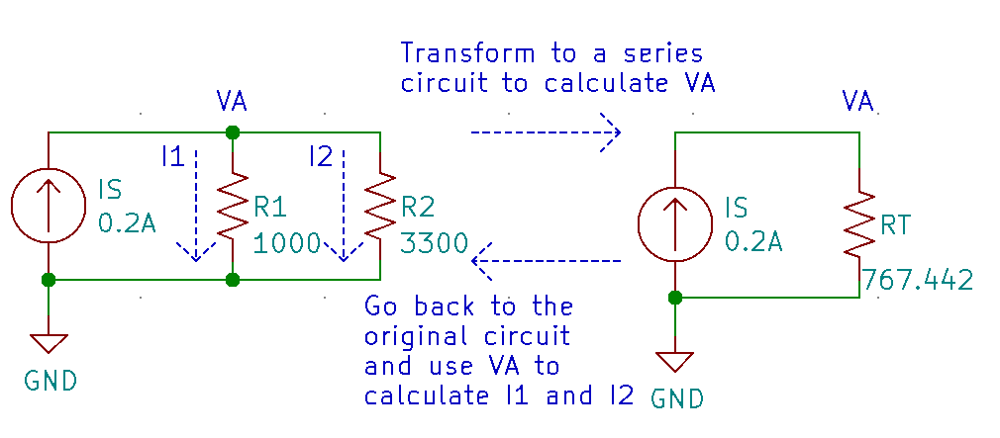
  <figcaption>Figure 7 - Example 7 soln</figcaption>
</figure> 

1. From examples 1 or $R_T = 767.442 Ω$ 
2. $V_A = I_S \cdot R_T = 0.2A \cdot 767.442\Omega = 153.488 V$
3. $I_1 = \frac{V_A}{R_1} = \frac{153.488 V}{1000\Omega} = 0.153A = 153mA$
   
   $I_2 = \frac{V_A}{R_2} = \frac{153.488 V}{3300\Omega} = 0.047A = 47mA$
    
4. $I_1 + I_2 = 153mA + 47mA = 200mA = 0.2A \equiv I_S$ Therefore KCL is verified!!!
5. Power delivered by the current source: $P_{I_S} = I_S \cdot V_A = 0.2A * 153.488V = 30.698W$
   
   Power dissipated in resistor R1: $P_{R_1} = I^2_1 \cdot R_1 = {153mA}^2 \cdot 1000 \Omega= 23.409W$

   Power dissipated in resistor R2: $P_{R_2} = I^2_2 \cdot R_2 = {47mA}^2 \cdot 3300 \Omega= 7.290W$

   Total power dissipated in resistors:  $P_{R_1} + P_{R_2} = 23.409W + 7.290W = 30.699W \equiv P_{I_S}$

   Therefore law of conservation of energy is verified!!!
         
## Current Divider rule

The current divider rule states that the current $I_{R_X}$ flowing through a resistor $R_X$ is equivalent to the product of the supply
current $I_S$ and the ratio of total resistance $R_T$ to the resistor $R_X$ i.e.

$$I_{R_X} = I_S \cdot \frac{R_T}{R_X}$$

Note that this is a special case of Ohm\'s law.

$$I_{R_X} = I_S \cdot \frac{R_T}{R_X} \equiv \frac{I_S \cdot R_T}{R_X} = \frac{V_A}{R_X}$$

where $V_A$ is the voltage across all components in the parallel circuit.

### Example 8

In the circuit below calculate:

<!-- {.align-center
width="60.0%"} -->

<figure style="text-align:center">
  
  <figcaption>Figure 8 - Example 8</figcaption>
</figure> 

1.  The total equivalent resistance $R_T$
2.  The voltage $V_A$
3.  The currents $I_1$, $I_2$ & $I_3$ using the current divider rule
4.  The currents $I_1$, $I_2$ & $I_3$ using Ohm\'s law
5.  Verify KCL i.e. verify that $I_S = I_1 + I_2 + I_3$

### Solution

1. $R_T = \frac{1}{\frac{1}{470} + \frac{1}{560} + \frac{1}{680}   } = 185.737 \Omega$
2. $V_A = I_S * R_T = 0.2A \cdot 185.737 \Omega = 37.147V$
3. $I_1 = I_S \cdot \frac{R_T}{R_1} = 0.2A \cdot \frac{185.737 \Omega}{470 \Omega} = 79.037mA$
         
   $I_2 = I_S \cdot \frac{R_T}{R_2} = 0.2A \cdot \frac{185.737 \Omega}{560 \Omega} = 66.335mA$
         
   $I_3 = I_S \cdot \frac{R_T}{R_3} = 0.2A \cdot \frac{185.737 \Omega}{680 \Omega} = 54.629mA$

4. $I_1 = \frac{V_A}{R_1} = \frac{37.147V}{470\Omega} = 79.036 mA$
        
   $I_2 = \frac{V_A}{R_2} = \frac{37.147V}{560\Omega} = 66.334 mA$
   
   $I_3 = \frac{V_A}{R_3} = \frac{37.147V}{680\Omega} = 54.628 mA$

5. $I_1 + I_2 + I_3 =  79.037mA +  66.335mA + 54.629mA = 200.001mA \equiv I_S$

## Ideal & Practical Current Sources

Just like ideal voltage sources, ideal current sources are great for theoretical analysis but fall short when doing realistic modeling. The practical current source model exhibits a large resistance in parallel with the currents source as shown in the figure below:

<!-- {.align-center
width="80.0%"} -->

<figure style="text-align:center">
  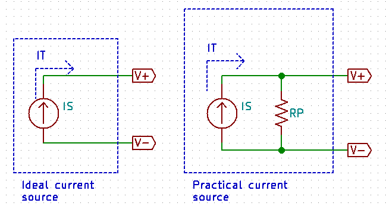
  <figcaption>Figure 9- Current Sources</figcaption>
</figure> 

**An ideal voltage source has zero series resistance, whereas an ideal current source has infinite parallel resistances**

There are two main implications to the practical current source:

-   **It limits the maximum voltage drop across the output terminals**. In the case of the ideal current source , the voltage across the
    terminals is determined primarily by the load. If the load is an open circuit, The voltage is theoretically infinite or very large.
    The practical current source\'s parallel resistor limits the effective load resistance and therefore reduces maximum voltage drop
    across the load.
-   **The current flowing across across the load is reduced from the current source rating**. Since some current flows through the
    current source\'s parallel resistance, the load resistance does not exhibit the rated current from the current source in its
    entirety.

### Example 9

Consider the schematic of an ideal and practical current source shown above. Assume that both current sources have a $I_S = 50mA$ and for the practical current source $R_P=100 k\Omega$.

1.  If the ideal current source terminals are opened, how much voltage will the power supply have across its terminals?
2.  If the practical current source terminal are opened, how much voltage will the power supply have across its terminals?
3.  A 330Ω load resistor $R_L$ is placed between the terminals of the ideal current source. Find the voltage across the load resistor and
    the current going through it.
4.  A 330Ω load resistor $R_L$ is placed between the terminals of the practical current source. Find the voltage across the load resistor
    and the current going through it.
5.  A 33Ω load resistor $R_L$ is placed between the terminals of the practical current source. Find the voltage across the load resistor     and the current going through it.

#### Solution
1. $V_A = I_S \cdot R_T = 50mA \cdot \infty = \infty V$  
2. $R_T = \frac{1}{ \frac{1}{100 K\Omega} + \frac{1}{\infty}}  = 100K\Omega$
   
   $V_A = I_S \cdot R_T = 50mA \cdot 100K\Omega = 5000 V$
     
3. $V_A = I_S \cdot R_T = 50mA \cdot 330 \Omega = 16.5V$

   $I_{R_L} =50mA$
    
4. $R_T = \frac{1}{ \frac{1}{100 K\Omega} + \frac{1}{330}}  = 328.915 \Omega$

   $V_A = I_S \cdot R_T = 50mA \cdot 328.915\Omega = 16.44V$

   $I_{R_L} = I_S \cdot \frac{R_T}{R_L} =  50mA \cdot \frac{328.915}{330} = 49.836mA$
      
5. $R_T = \frac{1}{ \frac{1}{100 K\Omega} + \frac{1}{33}}  = 32.989 \Omega$
   
   $V_A = I_S \cdot R_T = 50mA \cdot 32.989 \Omega = 1.649V$

   $I_{R_L} = I_S \cdot \frac{R_T}{R_L} =  50mA \cdot \frac{32.989}{33} = 49.983mA$
      
## Voltage and current source transformations

Practical voltage and current sources are interchangeable. In fact one can be *transformed* into the other.

When transforming a practical voltage source into a practical current source, the source resistance stays the same, and the current $I_S$
becomes:

$$I_S = \frac{V_S}{R_S}$$

When transforming a practical current source into a practical voltage source, the source resistance stays the same, and the voltage $V_S$ becomes:

$$V_S = I_S \cdot R_S$$

Both transformations are captured in the figure below:

<!-- {.align-center
width="80.0%"} -->

<figure style="text-align:center">
  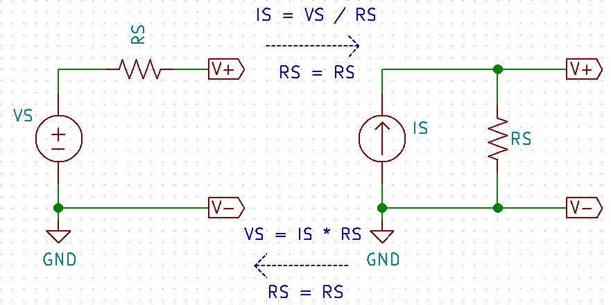
  <figcaption>Figure 10- Practical source transformation</figcaption>
</figure> 

### Example 10

Consider the schematic shown below:

<!-- {.align-center
width="40.0%"} -->

<figure style="text-align:center">
  
  <figcaption>Figure 11- Example 10</figcaption>
</figure> 

1.  Transform the practical voltage source (in the box) into a practical current source. Redraw the circuit with the practical current
    source.
2.  Calculate the current $I_{R_L}$ and the voltage $V_{R_L}$ in both the original circuit with the practical voltage source and in the
    transformed circuit with the practical current source.
    
#### Solution

1. The source resistance in the current source will be the same as the source resistance in the voltage source i.e. 4Ω but in parallel.
   The value of the current source will be: $I_S = \frac{V_S}{R_S} = \frac{6V}{4\Omega} = 1.5A$ 

 
 <figure style="text-align:center">
  
  <figcaption>Figure 12- Example 10.1</figcaption>
</figure> 

3. In the original circuit (with voltage source):
   
   $$I_{R_L} = \frac{V_S}{R_T} = \frac{6V}{104\Omega} = 57.692mA$$
   
   $$V_{R_L} = I_{R_L} \cdot R_L = 57.692mA \cdot 100\Omega = 5.769V$$
   
   In the transformed circuit (with current source):
   
   $$R_T = \frac{1 }{ \frac{1}{4} + \frac{1}{100} } = 3.846\Omega$$
   
   $$V_{R_L} = I_S \cdot R_T = 1.5A \cdot 3.846\Omega = 5.769V$$
   
   $$I_{R_L} = \frac{ V_{R_L} }{R_L} = \frac{5.769V}{100} =  57.690mA$$ 

### Example 11

Consider the schematic shown below:

<!-- {.align-center
width="40.0%"} -->

<figure style="text-align:center">
  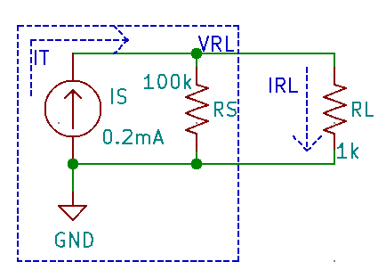
  <figcaption>Figure 13- Example 11</figcaption>
</figure> 

1.  Transform the practical current source (in the box) in to a practical voltage source. Redraw the circuit with the practical voltage      source.
2.  Calculate the current $I_{R_L}$ and the voltage $V_{R_L}$ in both the original circuit with the practical current source and in the      transformed circuit with the practical voltage source.

#### Solution

1. The source resistance in the voltage source will be the same as the source resistance in the current source i.e. 100kΩ but in series. The value of the voltage source will be: $$V_S = I_S \cdot R_S = 0.2mA \cdot 100k\Omega= 20V $$ 

 <!--   -->

<figure style="text-align:center">
  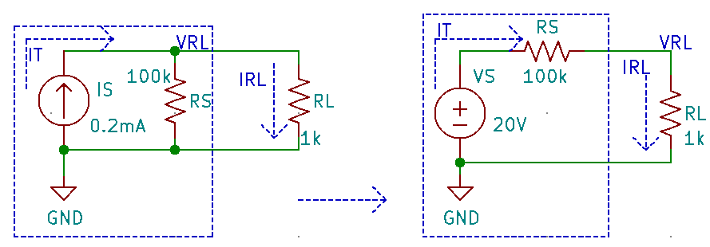
  <figcaption>Figure 14- Example 11.1</figcaption>
</figure> 

2. In the original circuit (with practical current source):
   
     $$R_T = \frac{1 }{ \frac{1}{100k\Omega} + \frac{1}{1k\Omega} } = 990.099\Omega$$
   
     $$V_{R_L} = I_S \cdot R_T = 0.2mA \cdot 990.099\Omega = 0.198V$$
   
     $$I_{R_L} = \frac{ V_{R_L} }{R_L} = \frac{0.198V}{1k\Omega} =  0.198mA$$
   
     In the transformed circuit (with practical voltage source):
   
     $$I_{R_L} = \frac{V_S}{R_T} = \frac{20V}{100k\Omega + 1k\Omega} = 0.198mA$$
   
     $$V_{R_L} = I_{R_L} \cdot R_L = 0.198mA \cdot 1k\Omega = 0.198V$$
     
## Maximum Power Transfer

The Maximum Power transfer theorem states that in order to ensure that maximum power is delivered to a load resistor $R_L$, **the resistance of the load resistor must be identical to the resistance of the source resistance**. Where $R_S$ is the internal parallel source resistance of the practical current source

<!-- {.align-center
width="40.0%"} -->

<figure style="text-align:center">
  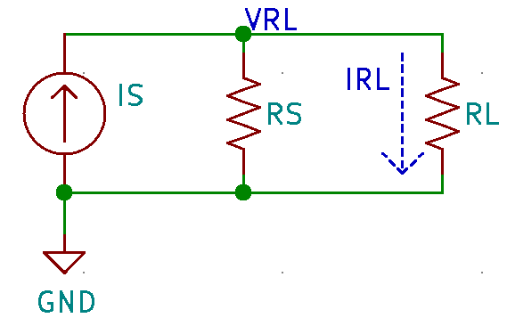
  <figcaption>Figure 15- Maximum Power Transfer</figcaption>
</figure> 

In otherwords, maximum power is delivered to the load when $R_L \equiv R_S$

### Example 12

Consider the figure shown above. Assume that $I_S=1mA$ and $R_S=100k\Omega$. Calculate the current across the load resistor
$I_{R_L}$ and the power dissipated in $R_L$; $P_{R_L}$, for each value of $R_L$ provided in the table below. Plot $P_{R_L}$ vs $R_L$ using a spreadsheet program such as LibreOffice Calc. Discuss your findings.

| RL(kΩ)      | RT(kΩ)       | IRL(mA)          | PRL(mW)            |
|-------------|--------------|------------------|--------------------| 
| 25          |              |                  |                    |
| 50          |              |                  |                    |
| 75          |              |                  |                    |
| 100         |              |                  |                    |
| 125         |              |                  |                    |
| 150         |              |                  |                    |
| 175         |              |                  |                    |
| 200         |              |                  |                    |

## The Law of conservation of Energy

The Law of convservation of Energy states that energy cannot be created nor destroyed. In other words:

**The power delivered by the source(s) in the circuit must always be equivalent to the sum of power dissipated by all the resistors in the same circuit.**

This is true regardless of circuit topology i.e. it applies to series circuits, parallel circuits, series-parallel circuits and complex-circuits.

In a single source circuit:

$$P_{V_S} = P_{R_1} + P_{R_2} + P_{R_3} + \cdots + P_{R_N}$$

And in a multiple source circuit:

$$P_{V_{S_1}} + P_{V_{S_2}} + P_{V_{S_3}} + \cdots + P_{V_{S_N}} = P_{R_1} + P_{R_2} + P_{R_3} + \cdots + P_{R_N}$$

Refer to Example 7.
