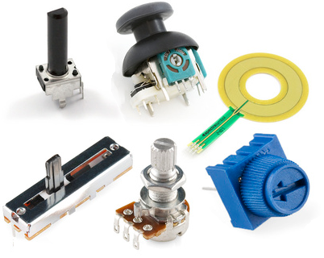

# Lesson 03 - Series Circuits

A series circuit is a circuit whose components are all connected in series or a chain like configuration as shown in the figure below.

<!-- -->
<!-- {.align-center width="30.0%"} -->

 <figure style="text-align:center">
  
  <figcaption>Figure.1 - Series Circuits</figcaption>
</figure> 

Because all components are connected in series or in a loop, **only one common current $I_T$ exists in this circuit. This current $I_T$  is exhibited by all the components in the series circuit.**

Before series circuits can be analyzed, some basic rules of electrical circuits will have to be covered. These include: 
- Ohm\'s Law, 
- Equivalent Resistance of series resistors, 
- and Kirchhoff\'s voltage law.

## Ohm\'s Law

Ohm\'s law states that the potential difference across a component is equivalent to the product of the current flowing through that component and that component\'s resistance.

$$ V = I \cdot R $$

where the voltage (V) is measured in volts (V), current (I) is measured in amperes (A) and resistance (R) is measured in Ohms (Ω).

### Example 1

<!--{.align-center
width="45.0%"} -->

 <figure style="text-align:center">
  
  <figcaption>Figure 2 - Example 1</figcaption>
</figure> 

In the series circuit shown above:

1. assume that $V_S = 6V$ and $R_L = 2.2k\Omega$. Solve for $I_T$
2. assume that $V_S = 6V$ and $I_T = 1mA$. Solve for $R_L$
3. assume that $I_T = 3.3mA$ and $R_L=1.47k\Omega$. Solve for $V_S$

#### Solution
1. $I_T = \frac{V_S}{R_L}= \frac{6V}{2.2k\Omega} = 2.727mA$
2. $R_L = \frac{V_S}{I_T}= \frac{6V}{1mA} =6k\Omega$
3. $V_S = I_T \cdot R_L = \frac{3.3mA}{1.47k\Omega} = 4.851V$

## Equivalent Resistance of Series Resistors / Resistive components

The total equivalent resistance of resistors in series can be calculated by simply summing the resistance of each of the resistors, i.e.

$$R_T = R_1 + R_2 + R_3 + \cdots + R_N$$

### Example 2

<!-- {.align-center
width="30.0%"} -->

 <figure style="text-align:center">
  
  <figcaption>Figure 3 - Example 2</figcaption>
</figure>

Assume that $R_1 = 220\Omega$, $R_2 = 470\Omega$ & $R_3 = 560\Omega$. Calculate the total resistance in the above circuit.

#### Solution

$$R_T = R_1 + R_2 + R_3 = 220 + 470 + 560 = 1250\Omega = 1.25k\Omega$$

## Kirchhoff\'s Voltage Law (KVL)

Kirchhoff\'s voltage law states that the sum of all voltage drops and rises across components and sources in a series circuit / loop must be zero. i.e.

<!-- {.align-center
width="50.0%"} -->

<figure style="text-align:center">
  
  <figcaption>Figure 4 - KVL</figcaption>
</figure>

$$V_1 + V_2 + V_3 + V_4 + \cdots + V_N = 0$$

Since $V_1$ in the above figure is a **voltage source that boosts voltage** and the other components are **resistors that drop voltage** we can rewrite the above equation as:

$$V_1 - V_2 - V_3 - V_4 = 0$$

$$V_1 = V_2 + V_3 + V_4$$

Voltage sources are usually denoted with the symbol $V_S$ to indicate that they exhibit voltage increases and not drops. Resistors typically exhibit voltage drops which are denoted with the symbol $V_R$. Taking these symbols into consideration and KVL can be redefined as:

$$V_{S1}  = V_{R1} + V_{R2} + V_{R3} + \cdots + V_{RN}$$

<!-- {.align-center
width="50.0%"} -->

<figure style="text-align:center">
  
  <figcaption>Figure 5 - KVL2</figcaption>
</figure>

In the case where they may be more than one voltage source available in a series circuit:

$$V_{S1} + V_{S2} + V_{S3} + \cdots + V_{SN}  = V_{R1} + V_{R2} + V_{R3} + \cdots + V_{RN}$$

Circuits with multiple voltage/current sources will be analyzed later in this course. For now, only single source circuits will be covered.

## Voltage Dividers

The voltage divider rule states that in a single source series circuit, the voltage drop across any resistor $R_X$ is equivalent to the product of the supply voltage and the ratio of the resistance value of resistor $R_X$ to the total equivalent resistance of the circuit $R_T$. i.e.:

$$V_{R_X} = V_S \cdot \frac{R_X}{R_T}$$

where,

$$R_T = R_1 + R_2 + R_3 + \cdots + R_N$$

### Example 3

<!-- {.align-center
width="30.0%"} -->

<figure style="text-align:center">
  
  <figcaption>Figure 6 - Example 3</figcaption>
</figure>

Consider the schematic shown in the figure above. Calculate:

1.  The total equivalent resistance of the circuit $R_T$
2.  The voltages $V_{R_S}$ and $V_{R_L}$ using the voltage divider rule
3.  Verify KVL i.e. verify that $V_S = V_{R_S} + V_{R_L}$

#### Solution

 
1. $R_T = R_S + R_L = 100\Omega + 220\Omega = 320\Omega$
2. $V_{R_L} = V_S \cdot \frac{R_L}{R_T} = 10V \cdot \frac{220}{320} = 6.875V$ 
   
   $V_{R_S} = V_S \cdot \frac{R_S}{R_T} = 10V \cdot \frac{100}{320} = 3.125V$
3. $V_S = V_{R_S} + V_{R_L} = 3.125V + 6.875 = 10V \equiv V_S = 10V$ 

Therefore KVL is indeed verified!
## Analysis of Series circuits

### Example 4

<!-- {.align-center
width="30.0%"} -->

<figure style="text-align:center">
  
  <figcaption>Figure 7 - Example 4</figcaption>
</figure>

Consider the schematic shown in the figure above. Calculate:

1.  The total equivalent resistance of the circuit $R_T$
2.  The loop current $I_T$
3.  The voltages $V_{R_S}$ and $V_{R_L}$
4.  Verify KVL i.e. verify that $V_S = V_{RS} + V_{RL}$
5.  Verify results via circuit simulator

#### Solution

A good strategy to solving series, parallel and series-parallel circuits is to always try and transform it to a series circuit with a single voltage source and a single resistor; as shown in the figure below:

<!-- <figure>
 
</figure> -->

<figure style="text-align:center">
  
  <figcaption>Figure 8 - Example 4.1</figcaption>
</figure>

From the voltage source's perspective, this simpler circuit is electrically equivalent
and will draw the same current since it has the same equivalent resistance as the original circuit.

The total current $I_T$ can be easily calculated by applying Ohm's law to the simplified circuit. Once the total current $I_T$ is calculated, go back to the original circuit and use $I_T$ to further analyze the circuit.
 
 1. $R_T = R_S + R_L = 330\Omega + 470\Omega = 800\Omega$ 
 2. Using Ohm's Law: $I_T = \frac{V_S}{R_L} = \frac{10}{800} = 12.500mA$
 3. Two approaches exist to calculate $V_{R_S}$ and $V_{R_L}$:
    1. Voltage Divider rule:
        
        $V_{R_L} = V_S \cdot \frac{R_L}{R_T} = 10V \cdot \frac{470}{800} = 5.875V$

        $V_{R_S} = V_S \cdot \frac{R_S}{R_T} = 10V \cdot \frac{330}{800} = 4.125V$
    2.  Ohm's Law:
      
        $V_{R_L} = I_T \cdot R_L = 12.500mA \cdot 470 = 5.875V$

        $V_{R_S} = I_T \cdot R_S = 12.500mA \cdot 330 = 4.125V$

   Notice how the voltage divider rule is just a special case of Ohm's law (in series circuits) as shown below:
   $$V_{R_X} = V_S \cdot \frac{R_X}{R_T} = \frac{V_S}{R_T} \cdot {R_X} = I_T \cdot R_X$$
   The Ohm's law approach is easier if you already know the current. If the current hasn't been calculated, use the voltage divider rule instead.

  4. $V_S = V_{R_S} + V_{R_L} = 5.875V + 4.125V = 10V \equiv V_S = 10V $
    
Therefore KVL is indeed verified!

<iframe src="static/circuit-sandbox/index.html" height="630" width="740" frameBorder="0"></iframe>

### Example 5

<!-- {.align-center
width="50.0%"} -->

<figure style="text-align:center">
  
  <figcaption>Figure 9 - Example 5</figcaption>
</figure>

Consider the schematic shown in the figure above. Calculate:

1.  The total equivalent resistance of the circuit $R_T$
2.  The loop current $I_T$
3.  The voltages $V_{R1}$, $V_{R2}$ and $V_{R3}$
4.  Verify KVL i.e. verify that $V_S = V_{R1} + V_{R2} + V_{R3}$
5.  Verify results via circuit simulator

#### Solution

1. $R_T = R_1 + R_2 + R_3 = 560\Omega + 1200\Omega + 2200\Omega = 3.960k\Omega$ 

2. Using Ohm's Law: $I_T = \frac{V_S}{R_L} = \frac{6V}{3.96k\Omega} = 1.515mA$

3. Two approaches exist to calculate $V_{R1}$, $V_{R2}$ and $V_{R3}$
    1. Voltage Divider rule:

       $V_{R_1} = V_S \cdot \frac{R_1}{R_T} = 6V \cdot \frac{560}{3960} = 0.848V$

       $V_{R_2} = V_S \cdot \frac{R_2}{R_T} = 6V \cdot \frac{1200}{3960} = 1.818V$

       $V_{R_3} = V_S \cdot \frac{R_3}{R_T} = 6V \cdot \frac{2200}{3960} = 3.333V$ 
       
    2. Ohm's Law:

       $V_{R_1} = I_T \cdot R_1 = 1.515mA \cdot 560 = 0.848V$

       $V_{R_2} = I_T \cdot R_2 = 1.515mA \cdot 1200 = 1.818V$

       $V_{R_3} = I_T \cdot R_3 = 1.515mA \cdot 2200 = 3.333V$

4. $V_S = V_{R_1} + V_{R_2} + V_{R_3} = 0.848V + 1.818V + 3.333V = 5.999V \simeq V_S = 6V$
  
Therefore KVL is indeed verified!

## Power Analysis

**Voltage and current source power**, i.e. they deliver power to other circuit components. **Resistors and another resistive components dissipate power**, i.e. they do something (work) with it or dissipate it as heat. The power sourced or dissipated by either type of component can be calculated using this equation:

$$P = V \cdot I$$

Substituting Ohm\'s law into the above equation gives us two more popular variants of it:

$$P = I^2 \cdot R$$

$$P = \frac{V^2}{R}$$

where P is power in watts(W), V is voltage in volts(V), I is current in amperes(A) and R is resistance in Ohms (Ω).

In any type of circuit topology (series, parallel, series-parallel, complex) **the total power sourced by all the voltage / current sources in the circuit must equal the total power dissipated by all the resistive components in the circuit.** This is a special case of the law of conservation of energy.

### Example 6

<!--{.align-center
width="30.0%"} -->

<figure style="text-align:center">
  
  <figcaption>Figure 10 - Example 6</figcaption>
</figure>

Consider the series circuit that was analyzed in Example 4. Calculate:

1.  Power delivered by the supply
2.  Power dissipated in resistor $R_S$
3.  Power dissipated in resistor $R_L$
4.  Verify the law of conservation of energy i.e. the power sourced from $V_S$ is equivalent to the power dissipated in resistors $R_S$ & $R_L$ or:

$$P_{V_S} = P_{R_S} + P_{R_L}$$

#### Solution

1. $P_{V_S} = V_S \cdot I_T = 10V * 12.500mA = 125.000 mW$
2. $P_{R_S} = V_{R_S} * I_{T} = 4.125V * 12.5mA = 51.563mW$ or

      $P_{R_S} = \frac{V^2_{R_S}}{R_S} = \frac{{4.125V}^2}{330} = 51.563mW$ or

      $P_{R_S} =  I^2_{T} \cdot R_S =  {12.5mA}^2 \cdot 330  = 51.563mW$ 
3. $P_{R_L} = V_{R_L} * I_{T} = 5.875V * 12.5mA = 73.438mW$ or

      $P_{R_L} = \frac{V^2_{R_L}}{R_L} = \frac{{5.875V}^2}{470} = 73.438mW$ or

      $P_{R_L} =  I^2_{T} \cdot R_L =  {12.5mA}^2 \cdot 470  = 73.438mW$ 

4. $P_{R_S} + P_{R_L} = 51.563mW + 73.438mW = 125.001mW \simeq P_{V_S}$ 

Therefore law of conservation of energy is verified!!

## Ideal and Practical Voltage sources

So far only ideal voltage sources have been considered. These voltage sources output a stable voltage that does not vary with current (that is independent of current). They also have no internal resistance and can source limitless amounts of current! While ideal voltage sources can come in handy when doing theoretical modeling, they do not model real
world power supplies very accurately. For starters, all real world power supplies are only able to source limited amounts of current at a given voltage. Also the voltage output may decrease as the current sourced increases. These phenomena are better captured by the practical voltage source.

<!-- {.align-center
width="70.0%"} -->

<figure style="text-align:center">
  
  <figcaption>Figure 11 - Voltage / Current Sources</figcaption>
</figure>

A practical voltage source consists of an ideal voltage source in series with a series resistor $R_S$. This series resistor is typically very small. Adding the series resistor has two effects on the voltage source:

- **It introduces a small voltage drop across resistance** $R_S$. This means that the voltage at the output terminals of the voltage source will be less than the voltage source\'s rated voltage. **This voltage drop will increase as the current sourced from the voltage source increases.**
-   **It limits the current that the voltage source can output**.

These effects make the practical voltage source a better real world
model for power supplies and batteries

### Example 7

Consider the schematic of an ideal and practical voltage source shown
above. Assume that both voltage sources have a $V_S = 12V$ and for the
practical voltage source $R_S=2\Omega$.

1.  If the ideal voltage source terminals are shorted, how much current
    will the power supply source?
2.  If the practical voltage source terminal are shorted, how much
    current will the power supply source?
3.  A 330Ω load resistor $R_L$ is placed between the terminals of the
    ideal voltage source. Find the voltage across the load resistor and
    the current going through it.
4.  A 330Ω load resistor $R_L$ is placed between the terminals of the
    practical voltage source. Find the voltage across the load resistor
    and the current going through it.
5.  A 33Ω load resistor $R_L$ is placed between the terminals of the
    practical voltage source. Find the voltage across the load resistor
    and the current going through it.

#### Solution

1. In this case $ I_T = \frac{V_S}{R_T} = \frac{V_S}{0} = \infty A$
2. $I_T = \frac{V_S}{R_T} = \frac{V_S}{R_S + 0} = \frac{12}{2} = 6A$
3. $I_{R_L} = \frac{V_S}{R_L} = \frac{12}{330} =  36.364mA$ 

   $V_{R_L} = 12V \equiv V_S $
4. $I_{R_L} = \frac{V_S}{R_L} = \frac{12}{330 + 2 } =  36.145mA$ 

   $V_{R_L} = I_{R_L} \cdot R_L = 36.145mA \cdot 330\Omega = 11.928V$
5. $I_{R_L} = \frac{V_S}{R_L} = \frac{12}{33 + 2 } =  342.857mA$ 

   $V_{R_L} = I_{R_L} \cdot R_L = 342.857mA \cdot 33\Omega = 11.314V$

Notice how as the resistance of the load resistor $R_L$ decreases, the actual load voltage  $V_{R_L}$ deviates further from the rated 12V.

## Maximum Power Transfer

The Maximum Power transfer theorem states that in order to ensure that maximum power is delivered to a load resistor $R_L$, **the resistance of the load resistor must be identical to the resistance of the source resistance**. Where $R_S$ is the source resistance that combines the internal resistance of the voltage source and cable (or other resistive elements) between the voltage source and the load.

<!-- {.align-center
width="40.0%"} -->

<figure style="text-align:center">
  
  <figcaption>Figure 12 - Maximum power transfer</figcaption>
</figure>

In otherwords, maximum power is delivered to the load when:
 $$R_L \equiv R_S$$

### Example 8

Consider the figure shown above. Assume that $V_S=10V$ and $R_S=1\Omega$. Calculate the current in the circuit $I_T$ and the power dissipated in $R_L$; $P_{R_L}$, for each value of $R_L$ provided in the table below. Plot $P_{R_L}$ vs $R_L$ using a spreadsheet program such as LibreOffice Calc. Discuss your findings.

| $R_L$ (Ω)     | $I_T$ (A)      | $P_{R_L}$ (W)         |
|---------------|----------------|-----------------------|
|   0.25        |                |                       |
|   0.50        |                |                       |
|   0.75        |                |                       |
|   1.00        |                |                       |
|   1.25        |                |                       |
|   1.5         |                |                       |
|   1.75        |                |                       |
|   2.00        |                |                       |

## The Law of conservation of Energy

The Law of conservation of Energy states that energy cannot be created nor destroyed. In other words:

**The power delivered by the source(s) in the circuit must always be equivalent to the sum of power dissipated by all the resistors in the same circuit.**

This is true regardless of circuit topology i.e. it applies to series circuits, parallel circuits, series-parallel circuits and
complex-circuits.

In a single source circuit:

$$P_{V_S} = P_{R_1} + P_{R_2} + P_{R_3} + \cdots + P_{R_N}$$

And in a multiple source circuit:

$$P_{V_{S_1}} + P_{V_{S_2}} + P_{V_{S_3}} + \cdots + P_{V_{S_N}} = P_{R_1} + P_{R_2} + P_{R_3} + \cdots + P_{R_N}$$

### Example 9

In the circuit shown below verify that
$P_{V_S} = P_{R_1} + P_{R_2} + P_{R_3}$

{.align-center
width="40.0%"}

<figure style="text-align:center">
  
  <figcaption>Figure 13 - Example 9</figcaption>
</figure>

#### Solution

First let's calculate $R_T$ and $I_T$:

$$R_T = R_1 + R_2 + R_3 = 100 + 220 + 330 = 650\Omega$$

$$I_T = \frac{V_S}{R_T} = \frac{6}{650} = 9.231mA$$

Power dissipated in the supply $V_S$ : 

$$ P_{V_S} = V_S \cdot I_T = 6V \cdot 9.231mA = 55.386mW $$

Power dissipated in the resistors: 
$$ P_{R_1} = I^2_T \cdot R_1 = {9.231mA}^2 \cdot 100 = 8.521mW $$
$$ P_{R_2} = I^2_T \cdot R_2 = {9.231mA}^2 \cdot 220 = 18.746mW $$
$$ P_{R_3} = I^2_T \cdot R_3 = {9.231mA}^2 \cdot 330 = 28.120mW $$

Total power dissipated in the three resistors: $$P_{R_1} + P_{R_2} + P_{R_3} = 28.120mW + 18.746mW + 8.521mW = 55.387mW \approxeq = P_{V_S} $$

## Power Efficiency

All real world electrical systems exhibit power losses. that is

$$P_{IN} = P_{OUT} + P_{LOSS}$$

For example a motor typically converts electrical energy to kinetic energy. But some of the electrical power applied to the motor will be dissipated as heat. This is a typical source of power loss in motors.

Ideally power loss is a phenomenon that the designer would like to significantly reduce when possible. But in order to understand it and possibly reduce it, the designer must be able to quantify and measure it. One metric for characterizing power loss is **Power Efficiency(η)**. Power efficiency is typically defined as:

$$\eta = \frac{P_{OUT}}{P_{IN}} \cdot 100%$$

It is a ratio of power output to power input. The closer this ratio is to 1.0 or 100% percentage-wise, the more power efficient the electricalsystem is. Power efficiency is unitless but could be represented as a ratio or a percentage.

### Example 10

An electrical motor rated for 1HP (horsepower) power output requires a power input of 1000W. Calculate the efficiency of this electrical motor. Hint: 1HP is equivalent to 745.7W.

#### Solution

$$ \eta = \frac{P_{OUT}}{P_{IN}} \cdot 100\% = \frac{1HP}{1000W} \cdot 100\% = \frac{745.7W}{1000W} \cdot 100\% = 74.570 \%$$
This electrical motor has an efficiency of 74.570%

## Resistor Ratings and Values

Resistors come in all shapes and sizes. For starters resistors come in
both throughhole and surface mount types.

<figure style="text-align:center">

<figcaption>Figure 14 - A through hole, half-watt (½W) resistor (above) sized up to
a quarter-watt (¼W) (Source: <a
href="https://cdn.sparkfun.com/assets/6/9/c/4/3/515dcac7ce395f7259000000.png">Sparkfun
resistor tutorial 01</a> ).</figcaption>
</figure>

<figure style="text-align:center">

<figcaption>Figure 15 - A tiny 0603 330Ω resistor hovering over shiny George
Washington's nose on top of a U.S. quarter (Source: <a
href="https://cdn.sparkfun.com/assets/4/e/e/7/f/515dcb62ce395f5959000000.jpg">Sparkfun
resistor tutorial 02</a> ).</figcaption>
</figure>

The resistance of throughhole resistors can be determined by the color
code shown below

<figure style="text-align:center">

<figcaption> Figure 16 - Resistor Color Codes (Source: <a
href="https://cdn.sparkfun.com/assets/learn_tutorials/6/4/Resistors.png">Sparkfun
resistor tutorial 03</a> ).</figcaption>
</figure>

The problem with color codes is that the colors on the resistors can sometimes be a bit off. It is almost always safer to use a multimeter to measure the resistance of a resistor

**ALWAYS USE A MULTIMETER TO DETERMINE THE RESISTANCE OF A RESISTOR!!!**

SMD resistors come in standardized sizes; usually either 0805 (0.8mm long by 0.5mm wide), 0603, or 0402. They\'re much smaller and use up less space. SMD resistors, like those in 0603 or 0805 packages, have their own way of displaying their value. There are a few common marking
methods you\'ll see on these resistors. They\'ll usually have three to four characters \-- numbers or letters \-- printed on top of the case.

If the three characters you\'re seeing are all numbers, you\'re probably looking at an **E24** marked resistor. The first two numbers represent the first two most-significant digits of the value, the last number represents a magnitude.

<figure style="text-align:center">

<figcaption>Figure 17 - Decoding E24 marked smd resistors (Source: <a
href="https://cdn.sparkfun.com/assets/b/b/1/6/6/5165e105ce395f443f000002.jpg">Sparkfun
resistor tutorial 04</a> ).</figcaption>
</figure>

In the above example picture, resistors are marked 104, 105, 205, 751,
and 754. The resistor marked with 104 should be 100kΩ (10x104), 105
would be 1MΩ (10x105), and 205 is 2MΩ (20x105). 751 is 750Ω (75x101),
and 754 is 750kΩ (75x104).

### Resistor symbols

Two common schematic symbols used to denote resistors in schematics are
shown below. The first is the American symbol and the second an
international style symbol.

<!-- {.align-center
width="70.0%"} -->

<figure style="text-align:center">

<figcaption>Figure 18 - Resistor symbols</figcaption>
</figure>

### Resistor Tolerances

Resistors typically tolerance ratings. Due to imperfections in the manufacturing process, the true (measured) resistance of a resistor may not be the same as its rating. However the measured resistance will always be within a certain rated tolerance of the measured value.Typical rated tolerances for resistors include 10%, 5%, 1% and 0.1%. Resistors with smaller tolerance ratings are usually more expensive to manufacture and thus to make.

### Example 11

Calculate the range of possible true resistance values of a 470 Ω
resistor with a rated tolerance of:

1.  10%
2.  5%
3.  1%
4.  0.1%

#### Solution

1. with a 10% rated tolerance: 
    
    $R_{min} = 470 \cdot \frac{100-10}{100} = 423.000 \Omega$ 
    
    $R_{max} = 470 \cdot \frac{100+10}{100} = 517.000 \Omega$ 

2. with a 5% rated tolerance: 

    $R_{min} = 470 \cdot \frac{100-5}{100} = 446.600 \Omega$ 
    
    $R_{max} = 470 \cdot \frac{100+5}{100} = 493.500 \Omega$

3. with a 1% rated tolerance: 

    $R_{min} = 470 \cdot \frac{100-1}{100} = 465.300 \Omega$ 
    
    $R_{max} = 470 \cdot \frac{100+1}{100} = 474.700 \Omega$

4. with a 0.1% rated tolerance: 

    $R_{min} = 470 \cdot \frac{100-0.1}{100} = 469.530 \Omega$ 

    $R_{max} = 470 \cdot \frac{100+0.1}{100} = 470.470 \Omega$

### Resistor Power Ratings

Resistors also have a power rating. Resistors should not dissipate more power than their power rating. Most common throughhole resistors have a power rating of 0.5/0.25 watts. SMD 0805 resistors have a power rating of 0.125 W.

### Example 12

The circuit shown below has a $V_S=5V$ and $R_L=1\Omega$. Assume that
the resistor $R_L$ has a power rating of 0.25W.

<!-- {.align-center
width="40.0%"} -->

<figure style="text-align:center">
  
  <figcaption>Figure 19 - Example 12</figcaption>
</figure> 

1.  How much power is dissipated in resistor $R_L$ ? Is it more than its
    power rating?
2.  Assuming that the voltage of the source and the power rating of
    $R_L$ remain unchanged, what is the smallest resistance of $R_L$
    that satisfies its power rating?

#### Solution

1. Since $V_{R_L}= 5V$ and $R_L= 1\Omega$, Power dissipated in the resistor becomes:
      $$ P = \frac{V^2_{R_L}}{R_L} = \frac{5^2}{1} = 25W$$
    Since the resistor rating is only 0.25W, this resistor is definitely dissipating more power than its rating and will almost instantly get damaged.
2. The smallest resistance that will dissipate 0.25W in this circuit is:
      $$ R_L = \frac{V^2_{R_L}}{P} = \frac{5^2}{0.25W} = 100\Omega $$
   Ideally the resistor should be about 10% larger ( i.e. 110Ω ) to provide a safety margin

A resistor\'s power rating can usually be deduced by observing its
package size. Standard through-hole resistors usually come with 0.25W or
0.5W ratings. More special purpose, power resistors might actually list
their power rating on the resistor as shown below.

<figure style="text-align:center">

<figcaption>Figure 20 - Power resistors (Source: <a
href="https://cdn.sparkfun.com/assets/7/7/3/6/1/5165e344ce395ff93e000000.jpg">Sparkfun
resistor tutorial 05</a> ).</figcaption>
</figure>

## Potentiometers

Resistors don\'t have to be static either. Variable resistors, known as potentiometers, are resistors which can be adjusted between a specific range of values. Potentiometers (or pots) connect two resistors internally, in series, and adjust a **center tap** between them creating an adjustable voltage divider. These variable resistors are often used for inputs, like volume knobs, which need to be adjustable.

<figure style="text-align:center">

<figcaption>Figure 21 - A smattering of potentiometers. From top-left, clockwise: a
standard 10k trimpot, 2-axis joystick, softpot, slide pot, classic
right-angle, and a breadboard friendly 10k trimpot. (Source: <a
href="https://cdn.sparkfun.com/assets/6/6/4/4/2/515deb26ce395f3959000000.png">Sparkfun
resistor tutorial 06</a> ).</figcaption>
</figure>

<figure style="text-align:center">

<figcaption>Figure 22 - <em>R</em>13 = <em>R</em>12 + <em>R</em>23</figcaption>
</figure>

In the figure below the resistance $R_{13}$ is the rate resistance of the potentiometer. The two resistances between the two furthest terminals of the pot and the center tap are labelled $R_{12}$ and $R_{23}$. Notice that $R_{13} = R_{12} + R_{23}$.
