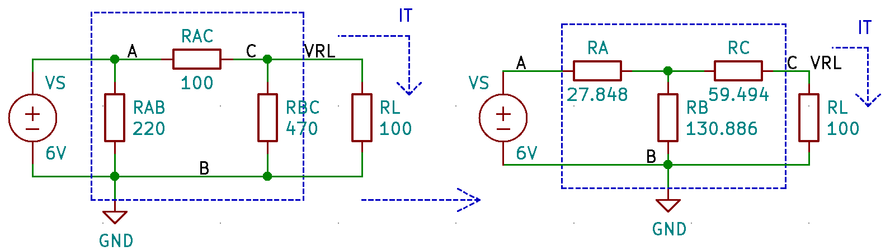

# Lesson 05 - Series-Parallel Circuits

Series-parallel circuits are a slightly more complicated circuit topology than the pure parallel and series circuit examined in these
notes. As its name implies, the series-parallel circuit topology consists of combinations of series and parallel circuits.

<!-- {.align-center
width="100.0%"} -->

 <figure style="text-align:center">
  
  <figcaption>Figure 1 - Series-Parallel Circuits</figcaption>
</figure> 

\
In the figure above, the circuit on the left (a) consists of two series circuits/branches connected in parallel. Whereas the circuit on the right (b), consists of two parallel circuits connected in series. Both circuits have a series-parallel topology.

By definition a series-parallel circuit is a circuit whose topology is neither only series nor parallel, but can still be *compressed* into a single resistance i.e. the resistances in the circuit can have an overall equivalent resistance in series with the voltage source as shown in the figure below:

<!-- {.align-center
width="100.0%"} -->

 <figure style="text-align:center">
  
  <figcaption>Figure 2 - Series-Parallel vs Complex Circuits</figcaption>
</figure> 

\
Because circuits (a) and (b) can be \'compressed\' into a single equivalent resistance, they are both classified as **series-parallel
circuits**. Notice that due to resistor R6, circuit (c) cannot be compressed into a single equivalent resistance. It is therefore
classified as a **complex circuit**. The techniques that will be introduced in this lesson will focus only on series-parallel circuits.

## Equivalent circuits

Analyzing series-parallel circuits involves 'compressing' the circuit into a series of equivalent circuits all the way until one equivalent resistance is left. From these equivalent circuits, crucial node voltages and current (such as the total current $I_T$ and node voltage $V_A$ in the figures shown below) can be extracted. With these values known, the circuit can be expanded back into its original form for further analysis. This process of analyzing a circuit by compressing it and expanding it, is referred to by the teacher as the **accordion** circuit analysis approach. But before examining this analysis technique in detail, the student needs to be comfortable with finding equivalent circuits.

In the figure below the resistances of a series-parallel circuit are compressed in several stages until only one equivalent resistance is
left. The process is illustrated relatively well in the figure below:

<!--  {.align-center
width="120.0%"} -->

 <figure style="text-align:center">
  
  <figcaption>Figure 3 - Equivalent circuits ex01</figcaption>
</figure> 

First it is important to note that **each branch in a series-parallel circuit (or a parallel circuit for that matter) can be treated as a series circuit**. This means that the equivalent resistance of the branch containing resistors R2 and R3 is $R_{EQ_1} = R_2 + R_3$. In a similar manner, the equivalent resistance of the branch containing resistors R4 and R5 is $R_{EQ_2} = R_4 + R_5$. We can then further compress these two equivalent resistances since they are in parallel: $R_{EQ_3} = R_{EQ_1} // R_{EQ_2}$. Finally since $R_{EQ_3}$ is now in series with $R_1$, They can be both added together in to the total equivalent resistance:

$$R_{EQ_4} = R_1 + R_{EQ_3} = R_1 + ((R_2 + R_3) \parallel (R_4+R_5))$$

### Example 1

In the figure above assume that $R_1 = 1k\Omega$, $R_2 = 2.2k\Omega$,
$R_3 = 4.7k\Omega$, $R_4 = 3.3k\Omega$ & $R_5 = 1k\Omega$.

Calculate $R_{EQ_1}$, $R_{EQ_2}$, $R_{EQ_3}$ and $R_{EQ_4}$.

#### Solution

$$R_{EQ_1} = R_2 + R_3 = 2.2k\Omega + 4.7k\Omega = 6.9k\Omega$$
$$R_{EQ_2} = R_4 + R_5 = 3.3k\Omega + 1k\Omega = 4.3k\Omega$$
$$R_{EQ_3} = (R_2 + R_3) \parallel (R_4 + R_5) = 6.9k\Omega \parallel 4.3k\Omega = \frac{1}{ \frac{1}{6.9k\Omega} + \frac{1}{4.3k\Omega}} = 2649.107\Omega$$
$$R_{EQ_4} = R_1 + ((R_2 + R_3) \parallel (R_4 + R_5)) = 1k\Omega + 2649.107\Omega = 3649.107\Omega$$

In the series-parallel circuits shown in the two preceding figure, the total current $I_T$ is identical in all four equivalent circuits
(a)-(d). Also the location of the node voltage $V_A$ is the same in circuits (a)-(c) but then disappears in circuit (d). This is because the location of the node voltage $V_A$ is sandwiched between $R_1$ and $R_{EQ_3}$ and as such is somewhere inside the equivalent resistance $R_{EQ_4}$.

The series of equivalent circuits for a second series-parallel circuit
is shown below.

<!-- {.align-center
width="120.0%"} -->

 <figure style="text-align:center">
  
  <figcaption>Figure 4 - Equivalent circuits ex02</figcaption>
</figure> 

### Example 2

In the figure above assume that $R_1 = 1k\Omega$, $R_2 = 2.2k\Omega$, $R_3 = 4.7k\Omega$, $R_4 = 3.3k\Omega$ & $R_5 = 1k\Omega$.
Calculate $R_{EQ_1}$, $R_{EQ_2}$, $R_{EQ_3}$ and $R_{EQ_4}$.

#### Solution

$$R_{EQ_1} = R_2 \parallel R_4 = 2.2k\Omega \parallel 3.3k\Omega = \frac{1}{ \frac{1}{3.3k\Omega} + \frac{1}{2.2k\Omega}} = 1320\Omega$$
$$R_{EQ_2} = R_3 \parallel R_5 = 4.7k\Omega \parallel 1k\Omega = \frac{1}{ \frac{1}{4.7k\Omega} + \frac{1}{1k\Omega}} = 824.561\Omega$$
$$R_{EQ_3} = (R_2 \parallel R_4) + (R_3 \parallel R_5) = 1320\Omega + 824.561\Omega =  2144.561\Omega$$
$$R_{EQ_4} = R_1 + (R_2 \parallel R_4) + (R_3 \parallel R_5) = 1k\Omega + 2144.561\Omega = 3144.561\Omega$$

## Analyzing Series-Parallel Circuits

Analyzing series-parallel circuits involves compressing the circuit into a series of equivalent circuits all the way until one equivalent
resistance is left. From these equivalent circuits crucial node voltages and current (such as the total current $I_T$ and node voltage $V_A$ in the figures shown below) can be extracted. With these values known, the circuit can be expanded back into its original form for further analysis. This process of analyzing a circuit by compressing it and expanding it, is referred to by the teacher as the **accordion** circuit analysis approach.

It is also important to remember that each branch in a series-parallel circuit can be analyzed as an independent series circuit whose branch voltage is the supply voltage.

### Example 3

Assuming $V_S = 10V$ in the figure shown below, calculate:

1.  $R_3 \parallel R_4$
2.  Total equivalent resistance $R_T$
3.  $V_A$ & $V_{R_3 \parallel R_4}$
4.  $I_T$
5.  $I_{R_3}$ and $I_{R_4}$
6.  $V_{R_1}$ and $V_{R_2}$
7.  Verify KCL i.e. $I_T = I_{R_3} + I_{R_4}$
8.  Verify KVL i.e. $V_S = V_{R_1} + V_A$

<!-- {.align-center
width="50.0%"} -->

 <figure style="text-align:center">
  
  <figcaption>Figure 5 - Example 3</figcaption>
</figure> 

#### Solution
The first step to derive various equivalent circuits:

   <!-- <figure>
    
  </figure> -->

  <figure style="text-align:center">
  
  <figcaption>Figure 5 - Example 3 II </figcaption>
</figure>  

\
1. $R_3 \parallel R_4 = \frac{1}{ \frac{1}{R_3} + \frac{1}{R_4}} =  \frac{1}{ \frac{1}{6.6k\Omega} + \frac{1}{6.6k\Omega}} = 3.3k\Omega$
2. $R_T = R_1 + R_3 \parallel R_4 + R_2 = 2.2k\Omega + 3.3k\Omega + 4.7k\Omega = 10.2k\Omega$
3. $V_A = V_S \cdot \frac{(R_3 \parallel R_4) + R_2}{R_T} =  10V \cdot \frac{8k\Omega}{10.2k\Omega} = 7.843V$

   $V_{R_3 \parallel R_4} = V_S \cdot \frac{(R_3 \parallel R_4)}{R_T} =  10V \cdot \frac{3.3k\Omega}{10.2k\Omega} = 3.235V$

4. $I_T = \frac{V_S}{R_T} = \frac{10V}{10.2k\Omega} = 0.980mA$
5. Now that $V_{R3 \parallel R4}$ is known, calculating the branch currents is straight forward:

   $I_{R_3} =  \frac{V_{R_3 \parallel R_4} }{R_3} = \frac{3.235V}{6.6k\Omega} = 0.490mA$

   $I_{R_4} =  \frac{V_{R_3 \parallel R_4} }{R_4} = \frac{3.235V}{6.6k\Omega} = 0.490mA$

6. $V_{R_1} = V_S \cdot \frac{R_1}{R_T} = 10V \cdot \frac{2.2k\Omega}{10.2k\Omega} = 2.157V$
        
   $V_{R_2} = V_S \cdot \frac{R_2}{R_T} = 10V \cdot \frac{4.7k\Omega}{10.2k\Omega} = 4.608V$
   
7. $I_{R_3} + I_{R_4} = 0.490mA + 0.490mA = 0.980mA \equiv I_T$

 Therefore, KCL is verified.

8. $V_{R_1} + V_{R_3 \parallel R_4} + V_{R_2} = 2.157V + 3.235V + 4.608V = 10V \equiv V_S$. 
   
 Therefore, KVL is verified.

### Example 4

Assuming $V_S = 10V$ in the figure shown below, calculate:

1.  $R_1 \parallel R_2$ & $(R_3 + R_4) \parallel R_5$
2.  Total equivalent resistance $R_T$
3.  $V_A$
4.  $I_T$
5.  $I_{R_3}$ and $I_{R_5}$
6.  $V_{R_1}$ and $V_{R_5}$
7.  Verify KCL i.e. $I_T = I_{R_3} + I_{R_5}$
8.  Verify KVL i.e. $V_S = V_{R_1} + V_A$

<!-- {.align-center
width="50.0%"} -->

<figure style="text-align:center">
  
  <figcaption>Figure 6 - Example 4 PI  </figcaption>
</figure>  

#### Solution

The first step to derive various equivalent circuits: 

 <!--  <figure>
    
  </figure> -->

<figure style="text-align:center">
  
  <figcaption>Figure 7 - Example 4 PII  </figcaption>
</figure>  

1. $R_1 \parallel R_2 = \frac{1}{ \frac{1}{R_1} + \frac{1}{R_2}} =  \frac{1}{ \frac{1}{2.2k\Omega} + \frac{1}{3.3k\Omega}} = 1.32k\Omega$
   
   $(R_3 + R_4) \parallel R_5 = \frac{1}{ \frac{1}{R_3 + R_4 } + \frac{1}{R_5}} =  \frac{1}{ \frac{1}{3.2k\Omega} + \frac{1}{4.7k\Omega}} = 1903.797\Omega$
   
2. $R_T =  R_1 \parallel R_2 +  ((R_3 + R_4) \parallel R_5) = 1.32k\Omega + 1903.797\Omega = 3223.797\Omega$
3. $V_A = V_S \cdot \frac{(R_3 + R_4) \parallel R_5}{R_T} = 10V \cdot \frac{1903.797\Omega}{3223.797\Omega} = 5.905V$
4. $I_T = \frac{V_S}{R_T} = \frac{10V}{3223.797\Omega} = 3.102mA$
5. $I_{R_3} = \frac{V_A}{R_3 + R_4} = \frac{5.905V}{3.2k\Omega} = 1.845mA$
   
   $I_{R_5} = \frac{V_A}{R_5} = \frac{5.905V}{4.7k\Omega} = 1.256mA$

6. $V_{R_1} = V_{R_2} = V_{R_1 \parallel R_2} = V_S \cdot \frac{R_1 \parallel R_2}{R_T} = 10V \cdot \frac{1.32k\Omega}{3223.797\Omega} = 4.095V$

   $V_{R_5} = V_A = 5.905V$
   
8. $I_{R_3} + I_{R_5} =  1.845mA + 1.256mA = 3.101mA \equiv I_T $. Therefore, KCL is verified.
   
9. $V_S = V_{R_1} + V_A = 4.095V + 5.905V = 10V \equiv V_S$ Therefore KVL is verified.

## Voltage Divider Loading

<!-- {.align-center
width="25.0%"} -->

<figure style="text-align:center">
  
  <figcaption>Figure 8 -  Loaded voltage dividers  </figcaption>
</figure>  

Voltage dividers can be used to provide a stable (lower) DC output voltage from a stable DC input voltage. Consider the voltage divider
shown above. This voltage divider outputs a **no load voltage** $V_{NL} = 5V$ from a 12V DC source. One can derive the relationship between the ratio of the resistors $R_1$ & $R_2$ and the voltages $V_{NL}$ & $V_{S}$ using the voltage divider equation.

$$V_{NL} = V_S \cdot \frac{R_2}{R_1 + R_2}$$

$$\frac{V_{NL}}{V_S} = \frac{R_2}{R_1 + R_2}$$

$$\frac{V_{NL}}{V_S} \cdot \left( R_1 + R_2 \right) = R_2$$

$$\frac{V_{NL}}{V_S} \cdot R_1 + \frac{V_{NL}}{V_S} \cdot R_2  = R_2$$

$$\frac{V_{NL}}{V_S} \cdot R_1 = R_2 \cdot \left( 1 - \frac{V_{NL}}{V_S} \right)$$

$$\frac{V_{NL}}{V_S} \cdot R_1 = R_2 \cdot \left( \frac{V_S - V_{NL}}{V_S} \right)$$

This can be further simplified to:

$$R_1 = R_2 \cdot \left( \frac{V_S - V_{NL} }{V_{NL}} \right)$$

$$R_2 = R_1 \cdot \left( \frac{V_{NL} }{V_S - V_{NL} } \right)$$

### Example 5

1.  Assume that you want to build a voltage divider with a $V_S = 12V$
    and $V_{NL} = 5V$. If $R_2=1k\Omega$, calculate the value of $R_1$.
2.  Assume that you want to build a voltage divider with a $V_S = 12V$
    and $V_{NL} = 5V$. If $R_2=3.3k\Omega$, calculate the value of
    $R_1$.

#### Solution

1. $R_1 = R_2 \cdot \left( \frac{V_S - V_{NL} }{V_{NL}} \right) = 1k\Omega \cdot \left( \frac{12 - 5 }{5} \right) = 1.400k\Omega$
2. $R_1 = R_2 \cdot \left( \frac{V_S - V_{NL} }{V_{NL}} \right) = 3.3k\Omega \cdot \left( \frac{12 - 5 }{5} \right) = 4.620k\Omega$

<!-- <figure >
  
</figure> --> 

<figure style="text-align:center">
  
  <figcaption>Figure 9 - Example 5 </figcaption>
</figure>  

If a load is put across the output terminals of the voltage divider, i.e. across $R_2$, a loading effect is exhibited. The resistance of
$R_2$ is **loaded** due to the parallel resistance $R_L$ which changes the overall effective resistance of bottom half of the voltage divider.

Instead of being $R_2$, the effective resistance of the lower half of the voltage divider is now $R_2 \parallel  R_L$.

$$R_2 \parallel  R_L = \frac{1}{ \frac{1}{5k\Omega} + \frac{1}{10k\Omega}   } = 3.333k\Omega$$

This causes the output voltage to change.

$$V_L = V_S \cdot \frac{R_2 \parallel  R_L}{(R_2 \parallel  R_L) + R_1 } = 12 \cdot \frac{3.333k\Omega}{3.333k\Omega + 7k\Omega } = 3.871V$$

In the figure below, when putting a load resistor $R_L = 10k\Omega$ across $R_2$, the overall effective resistance of the lower half of the
divider becomes 3.33kΩ. This means that the ratio of the upper to lower resistances of the voltage divider has changed, and that the output
voltage with the load attached, $V_L$, does not equal the no-load voltage $V_{NL}$ anymore. This phenomenon is called **the loading effect**.

<!-- {.align-center
width="65.0%"} -->

<figure style="text-align:center">
  
  <figcaption>Figure 10 - Loading Effect </figcaption>
</figure>  

**The loading effect can be mitigated by making the value of resistor** $R_2$ **lower than** $R_L$ **by approximately 10 to 100 times**. Ideally the lower $R_2$ is, the lower the loading effect will be. Having said that, the smaller the resistance of $R_2$, the more current will **bleed**
through it. The designer must pay attention to how much current passes through $R_2$ and ensure that the power dissipated by $R_2$ does not
exceed its power rating. As a rule of thumb, you want to keep $R_2 \ge 100\Omega$. The current flowing through $R_2$ is sometimes referred to as **the bleeder current** $I_B$, and the resistor $R_2$ can be referred to as **the bleeder resistor** $R_B$.

To mitigate the loading effect in this scenario, make $R_2$ 10 to 100 times lower than $R_L$ i.e. $R_2=100\Omega$. The value of resistor $R_1$ will also have to change accordingly to maintain the ratio between $R_2$ & $R_1$:

$$R_2 = \frac{R_L}{100} = \frac{10000\Omega}{100}=100\Omega$$

$$R_1 = R_2 \cdot \left( \frac{V_S - V_{NL} }{V_{NL}} \right) = 100\Omega \cdot \left( \frac{12 - 5 }{5} \right) = 140\Omega$$

With this modification the equivalent resistance $R_2 \parallel R_L$ is almost equivalent to $R_2$:

$$R_2 \parallel  R_L = \frac{1}{ \frac{1}{100\Omega} + \frac{1}{10k\Omega}   } = 99.010\Omega$$

Because $R_2 \parallel  R_L$ is almost equivalent to $R_2$, $V_L$ becomes almost
equivalent to $V_NL$ :

$$V_L = V_S \cdot \frac{R_2 \parallel  R_L}{(R_2 \parallel  R_L) + R_1 } = 12 \cdot \frac{99.010\Omega}{99.010\Omega + 140\Omega } = 4.971V$$

<!-- {.align-center
width="65.0%"} -->

<figure style="text-align:center">
  
  <figcaption>Figure 11 - Loading Effect Mitigated </figcaption>
</figure>  

In this scenario, the loading effect is minimized because $R_2$ was chosen to be 100 times smaller than $R_L$, which in turn causes:

$$R_2 \parallel  R_L \approxeq R_2$$

And when $R_1$ is selected to maintain the ratio of $R_2$ to $R_1$

$$V_L \approxeq V_{NL}$$

In a similar manner, to minimize the loading effect between circuit blocks connected together, one must make the input resistance of each
circuit block as large as possible (ideally infinite), and make the output resistance of each circuit block as small as possible (ideally
0). Electronic components such as operational amplifiers and buffers typically have input resistances in the 10s of MegaOhms, and output
resistances in the 10s of Ohms.

<!-- {.align-center
width="65.0%"} -->

<figure style="text-align:center">
  
  <figcaption>Figure 12 - Mitigating the loading effect with Amplifiers</figcaption>
</figure>  

### Example 6

1.  Design a voltage divider whose $V_S$ = 10V and $V_{NL}=3V$. The
    voltage divider must be able to deliver almost 3V to a load resistor
    $R_L=50k\Omega$.
2.  Calculate $V_L$ to verify that it is very close to $V_{NL}$.
3.  Calculate the bleeder current flowing across $R_2$ and the power
    dissipated in that resistor.

#### Solution

1. Start by ensuring that: $R_2 = \frac{R_L}{100} = \frac{50000\Omega}{100}=500\Omega$

   Next solve for: $R_1 =  R_2 \cdot \left( \frac{V_S - V_{NL} }{V_{NL}} \right) = 500\Omega \cdot \left( \frac{10 - 3 }{3} \right) = 1166.667\Omega$   

 <!-- <figure >
   
 </figure> -->

 <figure style="text-align:center">
  
  <figcaption>Figure 13 - Example 6 part I</figcaption>
</figure>  

2. First calculate: $R_2 \parallel  R_L = \frac{1}{ \frac{1}{500\Omega} + \frac{1}{50k\Omega}   } = 495.050\Omega$

   Next: $V_L = V_S \cdot \frac{R_2 \parallel  R_L}{(R_2 \parallel R_L) + R_1 } = 10 \cdot \frac{495.050\Omega}{495.050\Omega + 1166.667\Omega } = 2.980V$

<!-- <figure >
   
 </figure> -->

 
<figure style="text-align:center">
  
  <figcaption>Figure 13 - Example 6 part II</figcaption>
</figure>  

c. $I_B = I_{R_2} =\frac{V_{R_2}}{R_2} = \frac{V_L}{R_2} = \frac{2.980}{500} = 5.960mA$
       
   $P_{R_2} = I^2_{R_2} \cdot R_2 =  5.960mA^2 \cdot 500 = 17.761mW$
  
## Delta-Wye and Wye-Delta Conversions

In some circuits, resistors are connected together to form a three
terminal network. Two such networks exist:

-   **Delta** (or **Pi**) configuration
-   **Wye** (or **Tee**) configuration

<!-- {.align-center
width="70.0%"} -->

<figure style="text-align:center">
  
  <figcaption>Figure 14 - three terminal network diagram</figcaption>
</figure>  

Both configurations are shown in the schematic above. Both configurations can be converted to the other. This technique can be used
to simplify circuits with a complex topology (such as an unbalanced bridge circuit) to a series-parallel topology. It can also be used to
transform series-parallel circuits into simpler series-parallel circuits.

To convert a **Delta** network to a **Wye** network:

$$R_A = \frac{R_{AB} \cdot R_{AC}}{ R_{AB} + R_{AC} + R_{BC} }$$

$$R_B = \frac{R_{AB} \cdot R_{BC}}{ R_{AB} + R_{AC} + R_{BC} }$$

$$R_C = \frac{R_{AC} \cdot R_{BC}}{ R_{AB} + R_{AC} + R_{BC} }$$

To convert a **Wye** network to a **Delta** network:

$$R_{AB} = \frac{R_A \cdot R_B + R_A \cdot R_C + R_B \cdot R_C}{R_C}$$

$$R_{BC} = \frac{R_A \cdot R_B + R_A \cdot R_C + R_B \cdot R_C}{R_A}$$

$$R_{AC} = \frac{R_A \cdot R_B + R_A \cdot R_C + R_B \cdot R_C}{R_B}$$

Consider the unbalanced bridge circuit shown in the figure below:

<!-- {.align-center
width="40.0%"} -->

<figure style="text-align:center">
  
  <figcaption>Figure 15 - Delta to Wye conversion 01</figcaption>
</figure>  

This circuit has a complex topology that cannot be easily simplified with the techniques covered so far. However notice how resistors $R_1$,
$R_2$ and $R_3$ form a delta (inverted). Resistors $R_3$, $R_4$ and $R_5$ form another delta. In order to simplify the circuit, transform
the inverted delta (consisting of $R_1$, $R_2$ and $R_3$) to it\'s wye equivalent as shown below. $R_1$ becomes $R_AB$, $R_2$ becomes $R_AC$ &
$R_3$ becomes $R_BC$. Now convert the delta resistances R_AB, R_BC and R_AC to the wye resistances R_A, R_B and R_C:

$$R_A = \frac{R_{AB} \cdot R_{AC}}{ R_{AB} + R_{AC} + R_{BC} } = \frac{12 \cdot 18}{ 12 + 18 + 6 } = 6\Omega$$

$$R_B = \frac{R_{AB} \cdot R_{BC}}{ R_{AB} + R_{AC} + R_{BC} } = \frac{12 \cdot 6}{ 12 + 18 + 6 } = 2\Omega$$

$$R_C = \frac{R_{AC} \cdot R_{BC}}{ R_{AB} + R_{AC} + R_{BC} } = \frac{18 \cdot 6}{ 12 + 18 + 6 } = 3\Omega$$

<!-- {.align-center
width="100.0%"} -->

<figure style="text-align:center">
  
  <figcaption>Figure 16 - Delta to Wye conversion 02</figcaption>
</figure>  

One can quickly verify that the circuits shown above are equivalent, by simulating the circuits with and without the delta-to-wye
transformations and measuring the voltages across and currents flowing through resistors $R_4$ & $R_5$. 

### Example 7

Convert the delta resistor network shown in the figure below to a wye network. Use simulation to Verify that the original circuit (with the
delta) and the transformed circuit (wye) are equivalent.

<!-- {.align-center
width="60.0%"} -->

<figure style="text-align:center">
  
  <figcaption>Figure 17 - Example 7 Part I</figcaption>
</figure>  

#### Solution

First calculate the values of $R_A$, $R_B$ & $R_C$:

    $$R_A = \frac{R_{AB} \cdot R_{AC}}{ R_{AB} + R_{AC} + R_{BC} } = \frac{220 \cdot 100}{ 220 + 100 + 470 } = 27.848\Omega$$
    
    $$R_B = \frac{R_{AB} \cdot R_{BC}}{ R_{AB} + R_{AC} + R_{BC} } = \frac{220 \cdot 470}{ 220 + 100 + 470 } = 130.886\Omega$$
    
    $$R_C = \frac{R_{AC} \cdot R_{BC}}{ R_{AB} + R_{AC} + R_{BC} } = \frac{100 \cdot 470}{ 220 + 100 + 470 } = 59.494\Omega$$

The circuit becomes:

 <!--<figure >
   
 </figure> -->
 
<figure style="text-align:center">
  
  <figcaption>Figure 18 - Example 7 Part II</figcaption>
</figure>  

## Wheatstone Bridge

<!-- {.align-center
width="60.0%"} -->

<figure style="text-align:center">
  
  <figcaption>Figure 19 - Wheatstone Bridge</figcaption>
</figure> 

The circuit shown above is known as the **Wheatstone Bridge**. The Wheatsone bridge is said to be **Balanced** When $V_A = V_B$. This
happens when:

$$\frac{R_1}{R_3} = \frac{R_2}{R_4}$$

While this result can be deduced intuitively, it can also be proven as follows:

$$V_A - V_B = V_S \cdot \left[ \frac{R_3}{R_1 + R_3} - \frac{R_4}{R_2 + R_4} \right]$$

The bridge is said to be balanced when $V_A - V_B = 0$, which in turn means that:

$$\frac{R_3}{R_1 + R_3} = \frac{R_4}{R_2 + R_4}$$

$$R_3 \cdot \left( R_2 + R_4 \right) = R_4 \cdot \left( R_1 + R_3 \right)$$

$$R_3 \cdot R_2 + R_3 \cdot R_4 = R_4 \cdot R_1 + R_4 \cdot R_3$$

$$R_3 \cdot R_2 = R_4 \cdot R_1$$

$$\frac{R_1}{R_3} = \frac{R_2}{R_4}$$

### Example 8

<!-- {.align-center
width="60.0%"} -->

<figure style="text-align:center">
  
  <figcaption>Figure 20 - Example 8</figcaption>
</figure> 

Consider the Wheatstone bridge shown below. If R1 = 50Ω, R2=60Ω and R3=84Ω, what value of R4 will balance the bridge i.e. cause VA=VB ?

#### Solution

When the bridge is balanced, 
           $$\frac{R_1}{R_3} = \frac{R_2}{R_4}$$
    
Therefore, 
           $$R_4 = R_2 \cdot \frac{R_3}{R_1} = 60\Omega \cdot \frac{84\Omega}{50\Omega} = 100.800\Omega$$
